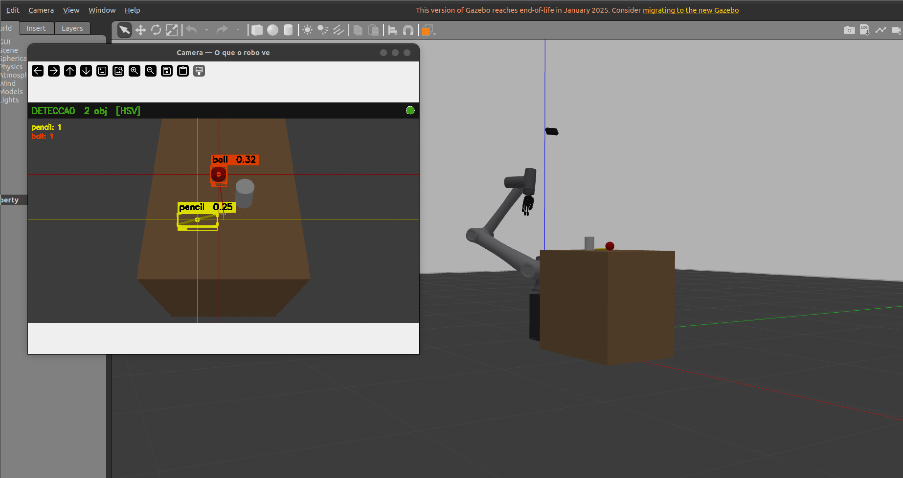
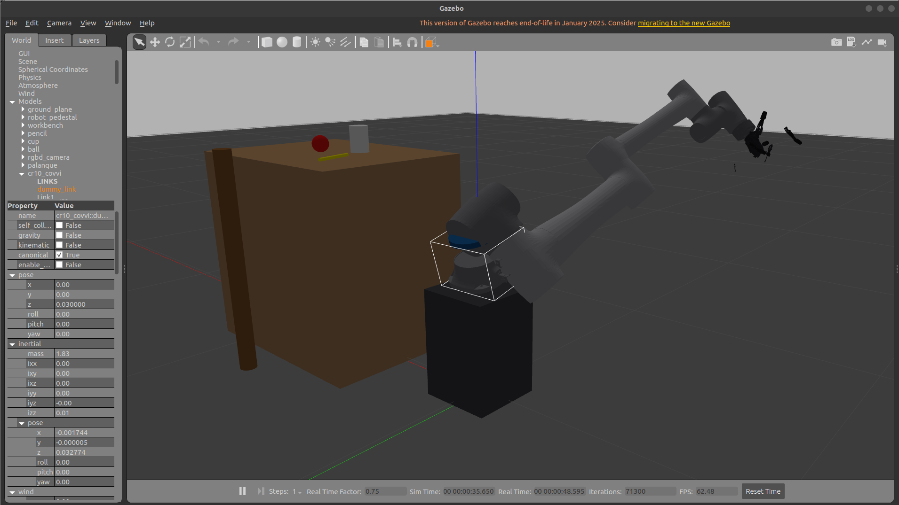

# RoboticArm — Gêmeo Digital CR10 + COVVI com Pipeline de Grasp Autônomo

> Braço industrial + mão biônica + visão computacional + machine learning, tudo rodando em simulação antes de ir pro hardware físico.

Esse projeto integra o braço robótico **Dobot CR10** com a mão protética **COVVI Hand** em um gêmeo digital completo no **ROS 2 Humble / Gazebo Classic 11**. O objetivo é ensinar o robô a pegar objetos de forma autônoma — ele enxerga pela câmera, estima onde os objetos estão, planeja o grasp e executa o movimento. Com cada ciclo, coleta dados e retreina o modelo ML pra melhorar.

---

## Em ação

### Demonstração completa — pipeline ML rodando

https://github.com/Martins-Lucaas/RoboticArm/raw/main/images/grasp_pipeline_demo.webm

---

### O que o robô vê e o que está acontecendo na simulação



> À esquerda: a janela da câmera com o detector HSV ativo — bola vermelha e lápis amarelo marcados em tempo real com bounding boxes, crosshairs e score de confiança. À direita: o CR10 com a mão COVVI já posicionado sobre a bancada, pronto pra executar o grasp.

---

### Braço alcançando o copo



---

| Braço Dobot CR10 | Mão COVVI |
|---|---|
|  |  |

| CR10 + COVVI no Gazebo | Closeup da mão |
|---|---|
|  |  |

| Objetos na bancada | Vista superior |
|---|---|
|  |  |

---

## Hardware

| Componente | Modelo | Specs |
|---|---|---|
| Braço | **Dobot CR10** | 6-DOF, alcance 1.3 m, payload 10 kg |
| Mão | **COVVI Hand** | 5 dedos + 11 juntas controladas (6 primárias + 25 mimic) |
| Câmera | RGB (Gazebo) | 848×480, FoV 70°, montada a 1.70 m de altura, 60° de inclinação |

---

## Como funciona

O pipeline tem 5 nós ROS 2 que conversam entre si:

```
Câmera RGB
    │
    ▼
[object_detector]   detecta objetos por cor (HSV) ou YOLOv8
    │  /detected_objects
    ▼
[pose_estimator]    retroprojeção pixel→3D até a bancada (z=0.75 m)
    │  /object_poses
    ▼
[grasp_planner]     calcula IK + score do grasp via ML (26 features)
    │  /selected_grasp  (JSON)
    ▼
[grasp_executor]    executa a trajetória: abordagem → descida → fechar mão → levantar → girar → soltar
    │  /grasp_result
    ▼
[pipeline]          orquestrador — máquina de estados que sequencia tudo
```

**Ordem de prioridade:** bola → copo → lápis

A cada grasp executado, dados de sucesso/falha são coletados. Com ~200 amostras já dá pra treinar um `RandomForestClassifier` decente, e o modelo fica progressivamente melhor com mais ciclos.

---

## Cinemática (IK)

A cinemática inversa usa **multi-start DLS com lambda adaptativo** — começa com damping alto (λ=0.08) pra estabilizar em poses de alta extensão e vai decaindo exponencialmente até λ=0.003 pra precisão fina. Isso resolve o problema clássico de oscilação do DLS perto do limite do workspace.

```
ros2 run grasp_ml_pack test_kin
```
```
✓ bancada centro  | err=  0.17 mm
✓ bancada esq.    | err=  0.35 mm
✓ bancada dir.    | err=  0.00 mm
✓ 45° frontal     | err=  0.03 mm
✓ alto lateral    | err=  0.19 mm

Resultado geral: PASS ✓
```

---

## Requisitos

| | Versão |
|---|---|
| Ubuntu | 22.04 LTS |
| ROS 2 | Humble Hawksbill |
| Gazebo | Classic 11 |
| Python | 3.10+ |

```bash
# Dependências ROS 2
sudo apt install -y \
  ros-humble-gazebo-ros-pkgs \
  ros-humble-ros2-control \
  ros-humble-ros2-controllers \
  ros-humble-xacro \
  ros-humble-joint-state-publisher-gui \
  ros-humble-vision-msgs \
  python3-tk

# Python — numpy<2 obrigatório (cv_bridge do Humble foi compilado com NumPy 1.x)
pip install "numpy<2" scikit-learn opencv-python-headless

# Opcional — MLP mais rápido que RF pra datasets grandes
pip install torch

# Opcional — YOLOv8 pro robô físico com GPU
pip install ultralytics
```

---

## Instalação

```bash
git clone https://github.com/Martins-Lucaas/RoboticArm.git ~/RoboticArm
cd ~/RoboticArm
colcon build --symlink-install
source install/setup.bash
```

---

## Rodando

### Pipeline completo (recomendado)

```bash
ros2 launch grasp_ml_pack grasp_pipeline.launch.py
```

O que acontece:
1. Gazebo carrega a cena com bancada, lápis amarelo, copo branco e bola vermelha
2. Robot State Publisher sobe com o URDF completo CR10 + COVVI
3. Controllers carregam em cadeia: `joint_state_broadcaster` → `cr10_group_controller` → `hand_position_controller`
4. Nós ML sobem depois que os controllers estão ativos
5. Uma janela **"Camera — O que o robo ve"** abre automaticamente mostrando o feed com detecções em tempo real

Quando o terminal mostrar isso, está pronto:
```
[grasp_executor]  Action servers prontos.
[pipeline]        Pipeline autônomo iniciado.
[object_detector] ObjectDetector pronto — modo: HSV-simulação
```

Com YOLOv8 (robô físico com GPU):
```bash
ros2 launch grasp_ml_pack grasp_pipeline.launch.py use_yolo:=true
```

### Testar IK isoladamente (sem ROS rodando)

```bash
ros2 run grasp_ml_pack test_kin
```

---

## Treinamento do modelo

```bash
# 1. Com a simulação rodando, coletar dados
ros2 run grasp_ml_pack generate_data --ros-args -p n_samples:=200

# 2. Treinar
ros2 run grasp_ml_pack train_model

# 3. Reiniciar o launch — o planner carrega o modelo automaticamente
ros2 launch grasp_ml_pack grasp_pipeline.launch.py
```

Saída esperada do treino:
```
RandomForest  CV AUC-ROC: 0.873 ± 0.021
Top-5 features: manipulability, reach_margin, q2, ik_converged, gp_z
[OK] Modelo salvo em: models/grasp_quality.pkl
```

| Iteração | Amostras | AUC-ROC esperado |
|---|---|---|
| 1ª | 200 | 0.70 – 0.82 |
| 2ª | 500 | 0.80 – 0.90 |
| 3ª | 1000+ | 0.88 – 0.95 |

---

## Estrutura do projeto

```
RoboticArm/
├── images/                         screenshots e mídia
├── src/
│   ├── grasp_ml_pack/              pacote principal — pipeline ML
│   │   ├── config/
│   │   │   ├── pipeline_params.yaml
│   │   │   └── grasp_database.yaml
│   │   ├── grasp_ml_pack/
│   │   │   ├── kinematics.py           IK analítica CR10 (DH padrão, multi-start DLS)
│   │   │   ├── object_detector.py      detecção HSV / YOLOv8 + janela imshow
│   │   │   ├── pose_estimator.py       retroprojeção 2D→3D
│   │   │   ├── grasp_planner.py        IK + scoring ML (26 features)
│   │   │   ├── grasp_executor.py       trajetória pick→lift→rotate→place
│   │   │   ├── pipeline.py             orquestrador (máquina de estados)
│   │   │   ├── grasp_quality_net.py    RandomForest / MLP PyTorch
│   │   │   └── scripts/
│   │   │       ├── generate_training_data.py
│   │   │       ├── train_grasp_model.py
│   │   │       └── test_kinematics.py
│   │   ├── launch/
│   │   │   └── grasp_pipeline.launch.py
│   │   └── worlds/
│   │       └── grasp_experiment.world
│   ├── hand_pack/                  controle manual da mão + braço
│   │   ├── config/cr10_covvi_controllers.yaml
│   │   ├── hand_pack/
│   │   │   ├── hand_gui.py
│   │   │   └── combined_gui.py
│   │   ├── launch/
│   │   │   ├── hand_gazebo.launch.py
│   │   │   ├── cr10_covvi_gazebo.launch.py
│   │   │   └── cr10_covvi_rviz.launch.py
│   │   └── urdf/linear_covvi_hand_gazebo.urdf
│   └── DOBOT_6Axis_ROS2_V4/        descrição do CR10 (submodule)
```

---

## RViz2 — Visualizações

| Dedos abertos | Dedos fechados |
|---|---|
|  |  |

| Malha de colisão | Vista lateral |
|---|---|
|  |  |

---

## Comandos úteis

```bash
# Ver o que o robô está vendo (alternativa ao imshow)
ros2 run rqt_image_view rqt_image_view /detector/debug_image

# Monitorar estado do pipeline
ros2 topic echo /pipeline/status
ros2 topic echo /grasp_result

# Verificar controllers
ros2 control list_controllers

# Build parcial
colcon build --packages-select grasp_ml_pack hand_pack --symlink-install

# Controle manual da mão (sem pipeline)
ros2 launch hand_pack cr10_covvi_gazebo.launch.py
ros2 run hand_pack combined_gui
```

> **Build travado?** Se aparecer `symbolic link ... Is a directory`:
> ```bash
> rm -rf build/dobot_msgs_v4/ament_cmake_python/dobot_msgs_v4/dobot_msgs_v4
> colcon build --symlink-install
> ```

---

## Tópicos principais

| Tópico | Tipo | O que é |
|---|---|---|
| `/camera/color/image_raw` | `sensor_msgs/Image` | Feed RGB cru do Gazebo |
| `/detector/debug_image` | `sensor_msgs/Image` | Feed com detecções desenhadas |
| `/detected_objects` | `vision_msgs/Detection2DArray` | Bboxes 2D por frame |
| `/object_poses` | `geometry_msgs/PoseArray` | Poses 3D em `base_link` |
| `/selected_grasp` | `std_msgs/String` (JSON) | Grasp escolhido + score |
| `/grasp_result` | `std_msgs/String` (JSON) | Sucesso/falha do grasp |
| `/pipeline/status` | `std_msgs/String` (JSON) | Estado atual da máquina de estados |

---

## Licença

Apache-2.0

Desenvolvido por **Lucas Martins** — [lucaspmartins14@gmail.com](mailto:lucaspmartins14@gmail.com)
