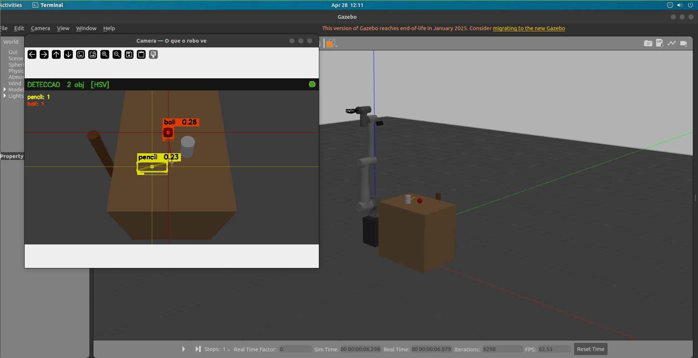
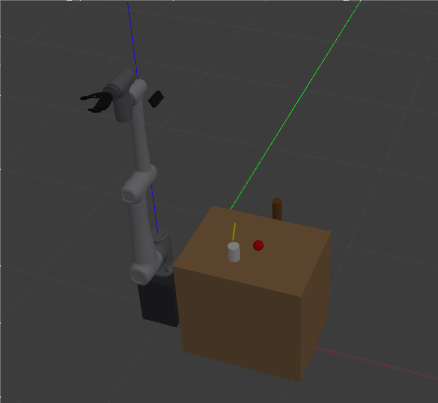
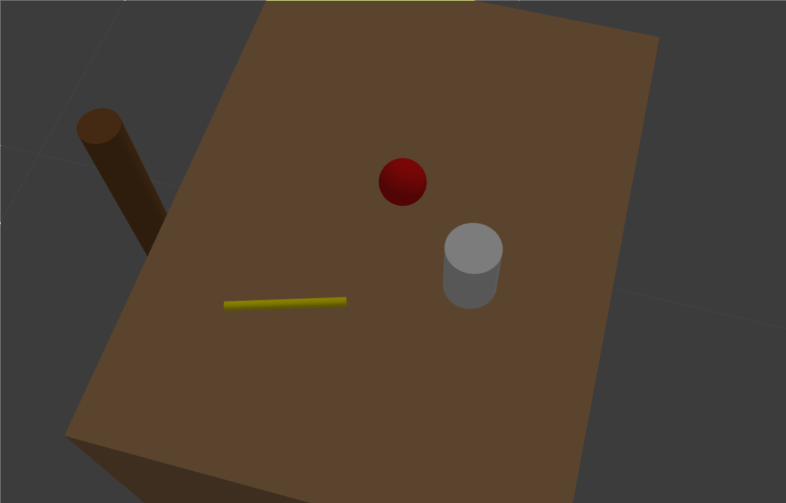
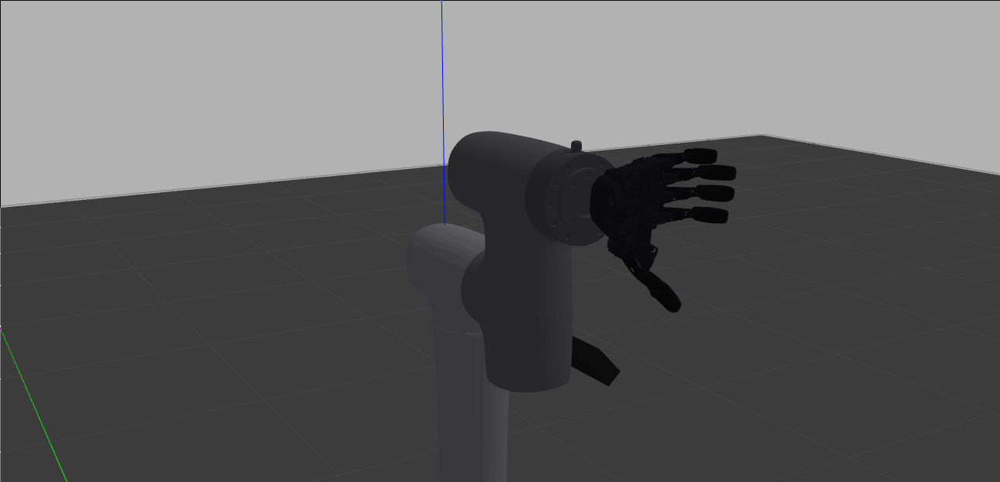
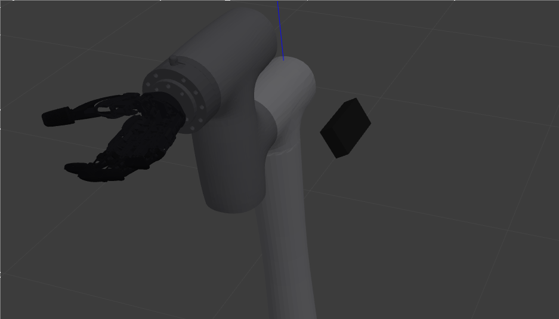
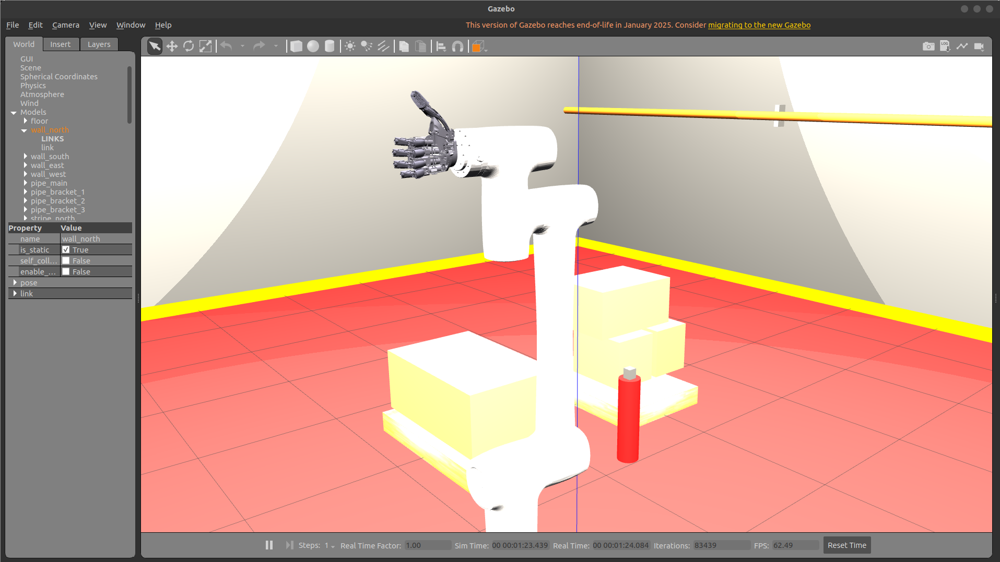

# RoboticArm — Pipeline de Grasp Autônomo com ML (CR10 + COVVI)

Gêmeo Digital (Digital Twin) da mão biônica **COVVI** integrada ao braço robótico industrial **Dobot CR10**, desenvolvido em **ROS 2 Humble** com simulação no **Gazebo Classic 11**.

O foco principal é o pipeline autônomo de **grasp com Machine Learning**: o robô detecta objetos pela câmera RGB, estima a pose 3D por retroprojeção geométrica, planeja e executa grasps, coleta dados de sucesso/falha e treina um classificador (`RandomForestClassifier` ou MLP via PyTorch) que melhora progressivamente a qualidade dos grasps.

---

## Hardware

| Componente | Modelo | Descrição |
|---|---|---|
| Braço | **Dobot CR10** | 6-DOF, alcance 1.3 m, payload 10 kg |
| Mão | **COVVI Hand** | 5 dedos biônicos + 11 juntas controladas |
| Câmera | RGB embutida no Gazebo | 848×480, FoV 70°, montada a 1.70 m |

| Braço Dobot CR10 | Mão COVVI |
|---|---|
|  |  |

---

## Demonstração

### Simulação em execução — Gazebo + detecção HSV em tempo real


> Janela da câmera (esquerda) mostrando detecção HSV ativa com bounding boxes e scores. Cena Gazebo (direita) com CR10 + COVVI sobre o pedestal, bancada e objetos.

### Câmera — O que o robô vê (detecção HSV)


### Objetos sobre a bancada
| Vista lateral | Vista superior |
|---|---|
|  |  |

### Braço CR10 — Posição Home e mão COVVI
| CR10 posição home | Closeup mão COVVI |
|---|---|
|  |  |

### Cena de colisão Gazebo (meshes de colisão visíveis)


---

## Design & Modelagem — COVVI Hand

### Design interno 3D (RViz)


### CAD — Dedos estendidos (RViz + Joint State Publisher)


### Controle manual da mão (Gazebo + GUI Tkinter)


---

## RViz2 — Visualizações

| Dedos abertos | Dedos fechados |
|---|---|
|  |  |

| Malha de colisão (CR10 + COVVI) | Vista lateral CR10 + COVVI |
|---|---|
|  |  |

---

## Funcionalidades

- **Simulação de Alta Fidelidade** — URDF com malhas STL originais da COVVI Hand, inércias e massas calibradas para o Gazebo.
- **Pipeline ML Completo** — Detecção HSV/YOLOv8 → retroprojeção geométrica → IK + scoring → execução → coleta → treino → iteração.
- **Câmera RGB embutida** — Janela `cv2.imshow` abre automaticamente ao lançar a simulação, mostrando bboxes, crosshairs e scores em tempo real.
- **GraspQualityNet** — MLP PyTorch (CPU/GPU) ou `RandomForestClassifier` sklearn (fallback), treinado sobre 26 features (geometria + cinemática IK).
- **Prioridade de Grasp** — Sequência automática: bola → copo → lápis.
- **Controle via ROS 2 Control** — `joint_trajectory_controller` para movimentos suaves em todas as 11 juntas da mão + 6 do braço.
- **GUI de Controle Manual** — Tkinter com sliders por dedo para testes manuais.

---

## Requisitos

| Componente | Versão |
|---|---|
| Ubuntu | 22.04 LTS (Jammy) |
| ROS 2 | Humble Hawksbill |
| Gazebo | Classic (Gazebo 11) |
| Python | 3.10+ |

### Dependências ROS 2

```bash
sudo apt update
sudo apt install -y \
  ros-humble-gazebo-ros-pkgs \
  ros-humble-ros2-control \
  ros-humble-ros2-controllers \
  ros-humble-xacro \
  ros-humble-joint-state-publisher-gui \
  ros-humble-vision-msgs \
  python3-tk
```

### Dependências Python

```bash
# NumPy < 2 obrigatório — cv_bridge do ROS 2 Humble foi compilado com NumPy 1.x
pip install "numpy<2" scikit-learn opencv-python-headless

# Opcional — MLP mais rápido que RandomForest para datasets grandes
pip install torch

# Opcional — apenas para modo com YOLOv8 (robô físico com GPU)
pip install ultralytics
```

---

## Instalação e Build

```bash
git clone https://github.com/Martins-Lucaas/RoboticArm.git ~/RoboticArm
cd ~/RoboticArm
colcon build --symlink-install
source install/setup.bash
```

---

## Estrutura do Repositório

```
RoboticArm/
├── images/                         # Screenshots e fotos dos componentes
├── models/                         # Dados e modelos treinados (gerados em runtime)
│   ├── training_data.npz           #   dataset coletado no Gazebo
│   └── grasp_quality.pkl           #   modelo treinado (RF ou MLP)
└── src/
    ├── grasp_ml_pack/              # Pacote principal — pipeline ML de grasp
    │   ├── config/
    │   │   ├── pipeline_params.yaml        # Parâmetros de todos os nós
    │   │   └── grasp_database.yaml         # BD de candidatos de grasp por objeto
    │   ├── grasp_ml_pack/
    │   │   ├── object_detector.py      # Detecção HSV / YOLOv8 + imshow
    │   │   ├── pose_estimator.py       # Retroprojeção 2D→3D (sem câmera de profundidade)
    │   │   ├── grasp_planner.py        # IK + scoring ML → grasp candidato
    │   │   ├── grasp_executor.py       # Execução da trajetória (pick→lift→place)
    │   │   ├── pipeline.py             # Orquestrador (máquina de estados)
    │   │   ├── grasp_quality_net.py    # GraspQualityNet (MLP PyTorch / RF sklearn)
    │   │   ├── kinematics.py           # IK analítica + manipulabilidade (parâmetros DH CR10)
    │   │   └── scripts/
    │   │       ├── generate_training_data.py   # Coleta dados de grasp no Gazebo
    │   │       ├── train_grasp_model.py        # Treina e avalia o modelo
    │   │       └── test_kinematics.py          # Testa IK analítica isoladamente
    │   ├── launch/
    │   │   └── grasp_pipeline.launch.py    # Launch principal — tudo em um comando
    │   └── worlds/
    │       └── grasp_experiment.world      # Bancada + câmera + objetos (lápis/copo/bola)
    ├── hand_pack/                  # Pacote da mão COVVI + braço CR10
    │   ├── config/
    │   │   ├── hand_controller.yaml            # Controller da mão isolada
    │   │   └── cr10_covvi_controllers.yaml     # Controllers combinados CR10+COVVI
    │   ├── hand_pack/
    │   │   ├── hand_gui.py         # GUI Tkinter para controle manual da mão
    │   │   └── combined_gui.py     # GUI combinada CR10 + mão
    │   ├── launch/
    │   │   ├── hand_gazebo.launch.py       # Mão COVVI isolada no Gazebo
    │   │   ├── spawn_hand.launch.xml       # Spawn simples da mão (sem controllers)
    │   │   ├── cr10_covvi_gazebo.launch.py # CR10 + COVVI no Gazebo
    │   │   ├── cr10_covvi_rviz.launch.py   # CR10 + COVVI no RViz2
    │   │   └── display.launch.py           # Visualização isolada da mão no RViz2
    │   └── urdf/
    │       └── linear_covvi_hand_gazebo.urdf
    └── DOBOT_6Axis_ROS2_V4/        # Pacote do braço CR10 (submodule externo)
```

---

## Launch Files — Referência Completa

### `grasp_ml_pack` — Pipeline ML

#### `grasp_pipeline.launch.py` — Launch principal

Inicia tudo de uma vez: Gazebo com bancada+câmera+objetos, CR10+COVVI com controllers, e todos os nós ML do pipeline.

```bash
# Modo padrão — detecção HSV (sem GPU, funciona no Gazebo)
ros2 launch grasp_ml_pack grasp_pipeline.launch.py

# Modo YOLOv8 — para deploy no robô físico com GPU
ros2 launch grasp_ml_pack grasp_pipeline.launch.py use_yolo:=true
```

**Sequência de inicialização:**
1. Gazebo carrega `grasp_experiment.world` (bancada + lápis amarelo + copo branco + bola vermelha)
2. `robot_state_publisher` publica o URDF mínimo (CR10 + COVVI)
3. `spawn_entity` coloca o robô no Gazebo em z=0.375 m
4. Controllers carregados em cadeia: `joint_state_broadcaster` → `cr10_group_controller` → `hand_position_controller`
5. Nós ML sobem após os controllers estarem ativos: `object_detector`, `pose_estimator`, `grasp_planner`, `grasp_executor`, `pipeline`

**Sinais de que está pronto (terminal):**
```
[grasp_executor]  Action servers prontos.
[pipeline]        Pipeline autônomo iniciado.
[object_detector] ObjectDetector pronto — modo: HSV-simulação
```
A **janela "Camera — O que o robo ve"** abre automaticamente mostrando o feed RGB com bounding boxes, crosshairs e scores em tempo real.

---

### `hand_pack` — Controle Manual

#### `hand_gazebo.launch.py` — Mão COVVI isolada no Gazebo

```bash
ros2 launch hand_pack hand_gazebo.launch.py
```

#### `cr10_covvi_gazebo.launch.py` — CR10 + COVVI no Gazebo

```bash
ros2 launch hand_pack cr10_covvi_gazebo.launch.py
```

#### `cr10_covvi_rviz.launch.py` — CR10 + COVVI no RViz2

```bash
ros2 launch hand_pack cr10_covvi_rviz.launch.py
```

#### `display.launch.py` — Mão COVVI no RViz2

```bash
ros2 launch hand_pack display.launch.py
```

---

## `ros2 run` — Referência Completa

### `grasp_ml_pack` — Nós individuais

```bash
# Detecção de objetos (HSV por padrão)
ros2 run grasp_ml_pack object_detector

# Estimativa de pose 3D (retroprojeção geométrica)
ros2 run grasp_ml_pack pose_estimator

# Planejamento de grasp (IK + scoring ML)
ros2 run grasp_ml_pack grasp_planner

# Execução de trajetória (pick → lift → place)
ros2 run grasp_ml_pack grasp_executor

# Orquestrador do pipeline (máquina de estados)
ros2 run grasp_ml_pack pipeline
```

Passando parâmetros com `--ros-args`:

```bash
# Detector com YOLOv8 e threshold customizado
ros2 run grasp_ml_pack object_detector \
  --ros-args -p use_yolo:=true -p confidence_threshold:=0.5

# Executor em modo simulação
ros2 run grasp_ml_pack grasp_executor \
  --ros-args -p simulation_mode:=true
```

### `grasp_ml_pack` — Scripts de treinamento

```bash
# Coletar dados de grasp (requer simulação rodando)
ros2 run grasp_ml_pack generate_data --ros-args -p n_samples:=500

# Coletar apenas amostras com IK válido (dados mais limpos)
ros2 run grasp_ml_pack generate_data --ros-args -p n_samples:=1000 -p ik_only:=true

# Treinar o modelo
ros2 run grasp_ml_pack train_model

# Testar a cinemática analítica isoladamente (não requer ROS ativo)
ros2 run grasp_ml_pack test_kin
```

### `hand_pack` — GUIs de controle manual

```bash
# GUI Tkinter para controle manual da mão COVVI
ros2 run hand_pack hand_gui

# GUI combinada CR10 + COVVI
ros2 run hand_pack combined_gui
```

---

## Pipeline Autônomo — Arquitetura

### Fluxo de dados

```
Câmera RGB (/camera/color/image_raw)
      │
      ▼
[object_detector]  ──── detecção HSV ou YOLOv8
      │ /detected_objects (Detection2DArray)
      ▼
[pose_estimator]   ──── retroprojeção geométrica pixel→3D (z_world=0.75 m)
      │ /object_poses (PoseArray + rótulos no frame_id)
      ▼
[grasp_planner]    ──── IK analítica + GraspQualityNet (26 features)
      │ /selected_grasp (String JSON)
      ▼
[grasp_executor]   ──── trajetória sinusoidal pick→lift→place via action server
      │ /grasp_result (String JSON)
      ▼
[pipeline]         ──── orquestrador: IDLE→DETECTING→ESTIMATING→PLANNING→EXECUTING→IDLE
```

### Máquina de estados (`pipeline.py`)

| Estado | O que faz | Timeout |
|--------|-----------|---------|
| `IDLE` | Seleciona o próximo objeto alvo pela ordem de prioridade | — |
| `DETECTING` | Aguarda o objeto alvo aparecer no `/detected_objects` | 60 s |
| `ESTIMATING` | Aguarda pose 3D válida em `/object_poses` | 20 s |
| `PLANNING` | Aguarda grasp selecionado em `/selected_grasp` | 20 s |
| `EXECUTING` | Envia goal ao action server do executor; aguarda resultado | 240 s |
| (fim) | Após completar bola→copo→lápis, encerra o pipeline | — |

**Ordem de prioridade:** `ball` → `cup` → `pencil`

### Detecção de objetos

| Objeto | Modo HSV — faixas | Cor Gazebo |
|--------|-------------------|------------|
| Bola (vermelha) | H: 0–10 ∪ 170–180, S: 210–255, V: 60–255 | RGB (0.9, 0.05, 0.05) |
| Copo (branco) | H: 0–180, S: 0–90, V: 150–255 | RGB (0.95, 0.95, 0.95) |
| Lápis (amarelo) | H: 20–35, S: 80–255, V: 80–255 | RGB (1.0, 0.95, 0.0) |

> `S_min=210` para a bola é crítico: a mesa de madeira tem S≈120 e o palanque S≈186, ambos abaixo do limiar — eliminando falsos positivos.
> `S_max=90` para o copo captura reflexos especulares do Gazebo que deslocam a saturação do branco.

### Estimativa de pose 3D

Sem câmera de profundidade: usa a posição estática conhecida da câmera (x=0.10, y=0.0, z=1.70 m, pitch=1.05 rad) e retroprojeção até o plano da bancada (z_world=0.75 m).

```
pixel (u,v) → raio no frame óptico → frame world → interseção com z=0.75 m → frame base_link
```

### GraspQualityNet — 26 features

| Grupo | Features |
|-------|----------|
| Tipo de objeto | one-hot: pencil / cup / ball |
| Posição relativa do grasp | gp_x, gp_y, gp_z |
| Orientação do objeto | roll, pitch, yaw |
| Abertura da mão | aperture_norm |
| Configuração dos dedos | one-hot: pinch / cylindrical / spherical |
| Vetor de abordagem | av_x, av_y, av_z |
| Cinemática (IK) | q1–q6, manipulability, reach_margin, elbow_up, ik_converged |

Antes de ter dados treinados: heurística analítica baseada em distância e manipulabilidade.

---

## Tutorial de Treinamento

### Visão geral

```
[1] Lançar simulação  →  câmera e pipeline iniciam
        ↓
[2] Coletar dados (Gazebo executa grasps e registra sucesso/falha)
        ↓
[3] Treinar GraspQualityNet  (MLP CPU ou RandomForest)
        ↓
[4] Relançar simulação  →  modelo carrega automaticamente
        ↓
[5] Repetir  →  AUC-ROC sobe progressivamente
```

### Passo 1 — Lançar a simulação

```bash
source ~/RoboticArm/install/setup.bash
ros2 launch grasp_ml_pack grasp_pipeline.launch.py
```

### Passo 2 — Coletar dados de treinamento

Com a simulação rodando, abra um **segundo terminal**:

```bash
source ~/RoboticArm/install/setup.bash
ros2 run grasp_ml_pack generate_data --ros-args -p n_samples:=200
```

Saída esperada:
```
[data_collector] Amostras: 50/200 | sucesso: 65.0% | IK skip: 12
...
[data_collector] === COLETA CONCLUÍDA ===
  Total:    200 amostras | Sucessos: 130 (65.0%)
  Shape X:  (200, 26) | Salvo em: .../models/training_data.npz
```

### Passo 3 — Treinar o modelo

```bash
ros2 run grasp_ml_pack train_model
```

Saída esperada (RandomForest / MLP CPU):
```
RandomForest  CV AUC-ROC: 0.873 ± 0.021
Top-5 features: manipulability, reach_margin, q2, ik_converged, gp_z
[OK] Modelo salvo em: models/grasp_quality.pkl
```

> **Qualidade mínima:** AUC-ROC ≥ 0.75. Abaixo disso, colete mais dados.

### Passo 4 — Ativar o modelo treinado

O `grasp_planner` carrega o modelo automaticamente ao iniciar. Basta **reiniciar o launch**:

```bash
ros2 launch grasp_ml_pack grasp_pipeline.launch.py
```

### Ciclo de melhoria esperado

| Iteração | Amostras | AUC-ROC esperado |
|----------|----------|------------------|
| 1ª | 200 | 0.70 – 0.82 |
| 2ª | 500 | 0.80 – 0.90 |
| 3ª | 1 000+ | 0.88 – 0.95 |

---

## Tópicos ROS 2

| Tópico | Tipo | Descrição |
|--------|------|-----------|
| `/camera/color/image_raw` | `sensor_msgs/Image` | Feed RGB bruto (Gazebo) |
| `/detector/debug_image` | `sensor_msgs/Image` | Feed com detecções sobrepostas |
| `/detector/status` | `std_msgs/String` | Status textual (modo, objetos detectados) |
| `/detected_objects` | `vision_msgs/Detection2DArray` | Bboxes 2D por frame |
| `/object_poses` | `geometry_msgs/PoseArray` | Poses 3D em `base_link` |
| `/pose_estimator/debug_markers` | `visualization_msgs/MarkerArray` | Marcadores RViz dos objetos |
| `/pipeline/target` | `std_msgs/String` | Objeto alvo atual (`ball`/`cup`/`pencil`) |
| `/selected_grasp` | `std_msgs/String` (JSON) | Grasp selecionado + score |
| `/grasp_result` | `std_msgs/String` (JSON) | Resultado: sucesso/falha + score |
| `/pipeline/status` | `std_msgs/String` (JSON) | Estado atual da máquina de estados |

---

## Controle Manual da Mão COVVI

```bash
# Mão isolada no Gazebo + GUI
ros2 launch hand_pack hand_gazebo.launch.py
ros2 run hand_pack hand_gui

# CR10 + COVVI no Gazebo + GUI combinada
ros2 launch hand_pack cr10_covvi_gazebo.launch.py
ros2 run hand_pack combined_gui

# Apenas visualização no RViz2
ros2 launch hand_pack cr10_covvi_rviz.launch.py
```

| Controle GUI | Descrição |
|---|---|
| **Tempo de Movimento** | Duração da trajetória (segundos) |
| **Thumb / Index / Middle / Ring / Little** | Flexão proximal de cada dedo |
| **Rotate** | Oposição/rotação do polegar |
| **Sliders `_j01`** | Falanges distais (pontas dos dedos) |

---

## Diagnóstico e Monitoramento

```bash
# Verificar câmera (deve estar em ~30 Hz)
ros2 topic hz /camera/color/image_raw

# Ver câmera via rqt (alternativa ao imshow do nó detector)
ros2 run rqt_image_view rqt_image_view /detector/debug_image

# Monitorar pipeline em tempo real
ros2 topic echo /pipeline/status
ros2 topic echo /selected_grasp
ros2 topic echo /grasp_result

# Ver objetos detectados
ros2 topic echo /detected_objects

# Verificar controllers ativos
ros2 control list_controllers

# Ver estado das juntas
ros2 topic echo /joint_states
```

---

## Build — Comandos

```bash
# Build completo
colcon build --symlink-install
source install/setup.bash

# Build apenas os dois pacotes principais
colcon build --packages-select grasp_ml_pack hand_pack --symlink-install

# Build com logs detalhados
colcon build --packages-select grasp_ml_pack --event-handlers console_cohesion+
```

> **Problema comum:** se o build falhar com `symbolic link ... Is a directory`, rode:
> ```bash
> rm -rf build/dobot_msgs_v4/ament_cmake_python/dobot_msgs_v4/dobot_msgs_v4
> colcon build --symlink-install
> ```

---

## Configuração — `pipeline_params.yaml`

```yaml
object_detector:
  ros__parameters:
    use_yolo: false              # true para robô físico com GPU
    yolo_model: "yolov8n.pt"
    confidence_threshold: 0.45
    publish_debug: true

pose_estimator:
  ros__parameters:
    camera_pos_x: 0.10           # posição da câmera no frame world (metros)
    camera_pos_y: 0.0
    camera_pos_z: 1.70
    camera_pitch_rad: 1.05       # inclinação da câmera (radianos)
    table_z_world: 0.75          # altura da bancada no frame world
    robot_base_z_world: 0.375    # altura do base_link no frame world

grasp_planner:
  ros__parameters:
    n_candidates: 5
    score_threshold: 0.45

grasp_executor:
  ros__parameters:
    simulation_mode: true
```

---

## Licença

Distribuído sob a licença **Apache-2.0**.

Desenvolvido por **Lucas Martins** — [lucaspmartins14@gmail.com](mailto:lucaspmartins14@gmail.com)
