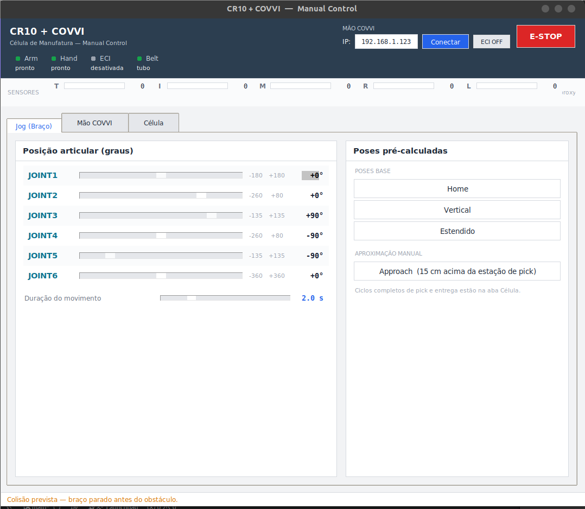
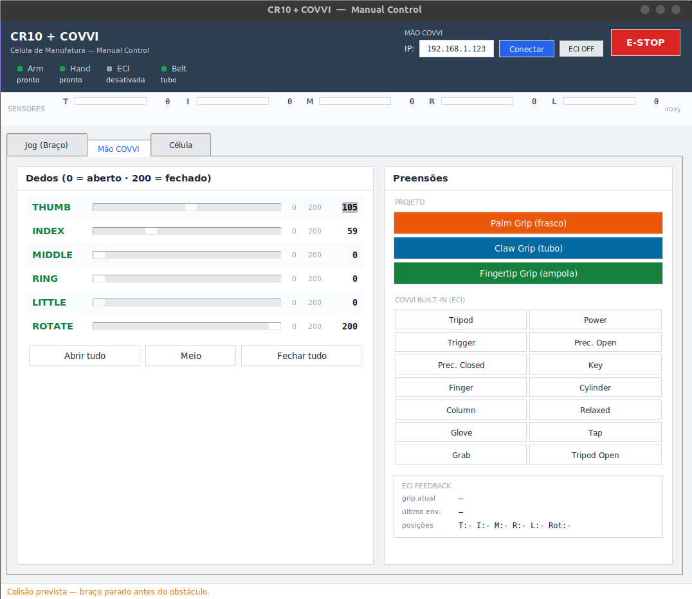
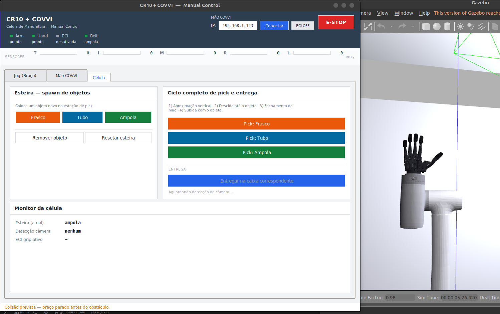
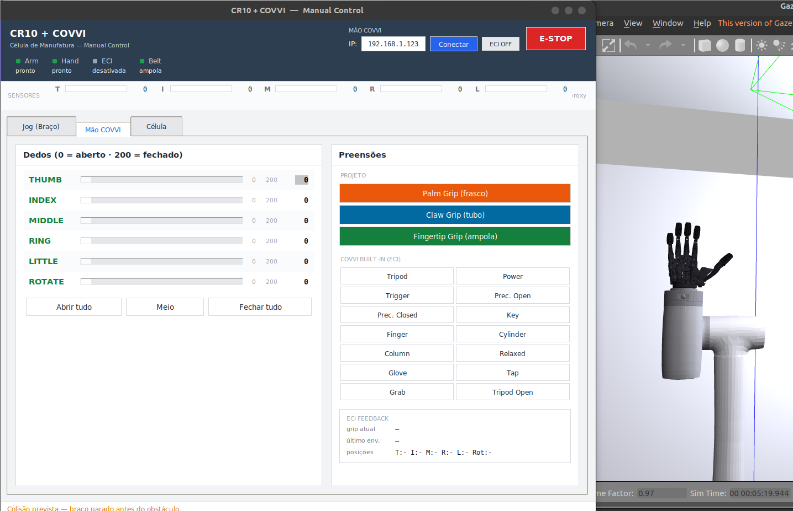
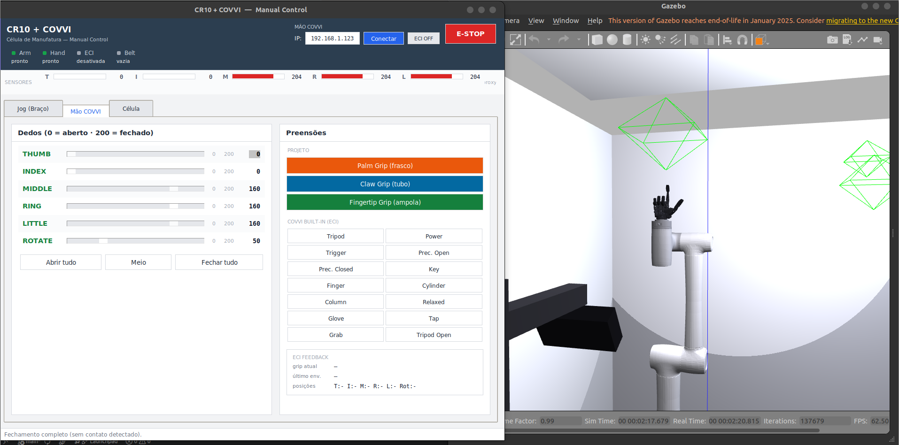
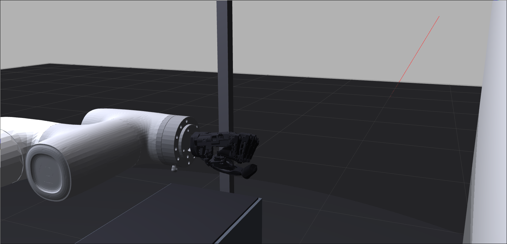
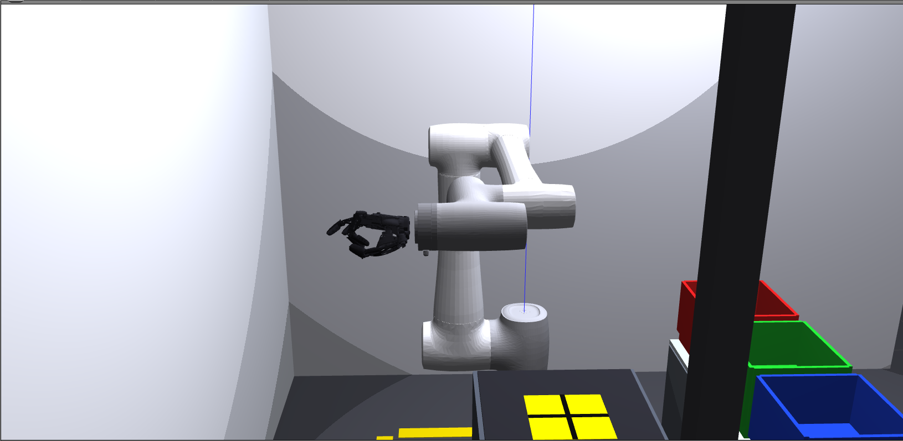
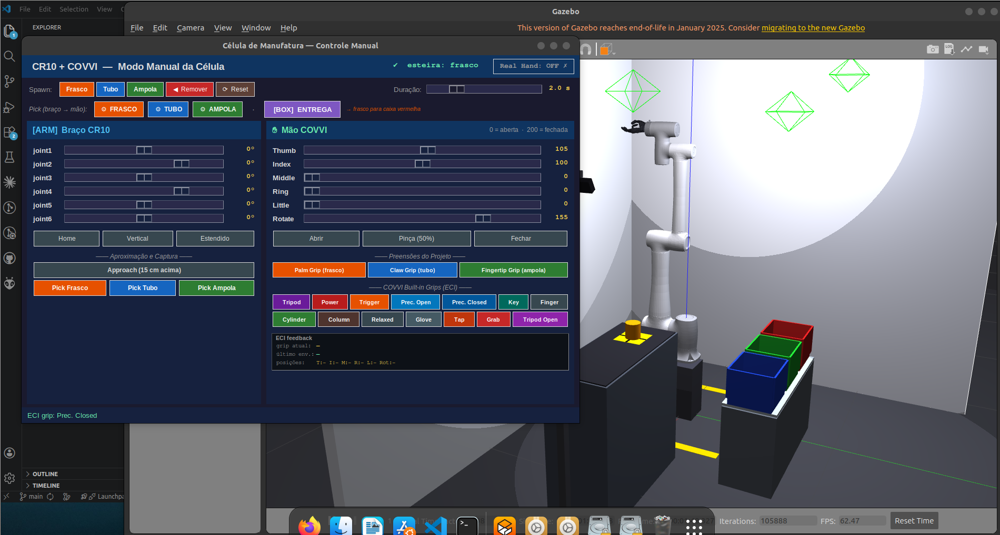
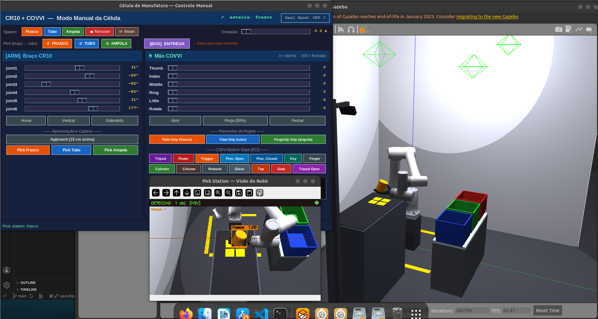

<div align="center">

# 🤖 RoboticArm
### Gêmeo Digital · CR10 + COVVI Hand · Célula de Manufatura Biomédica

[](https://docs.ros.org/en/humble/)
[](http://classic.gazebosim.org/)
[](https://releases.ubuntu.com/22.04/)
[](https://www.python.org/)
[](LICENSE)

**Braço industrial + mão protética biônica + visão computacional + esteira em simulação Gazebo,
com canal para a mão COVVI real via ECI.**
Base de treinamento para usuários de próteses de mão de múltiplos graus de liberdade.

</div>

> [!NOTE]
> Este projeto integra o braço **Dobot CR10** com a mão protética **COVVI Hand** em um gêmeo digital completo no **ROS 2 Humble / Gazebo Classic 11**. O robô identifica objetos farmacêuticos em uma esteira, classifica-os pelo tipo de preensão necessário e os deposita nas caixas de destino corretas. A mesma stack pode comandar a mão COVVI física via servidor ECI (`covvi_hand_driver`).
>
> Componente do **Trabalho de Conclusão de Curso (TCC)** em Engenharia Biomédica — desenvolvimento de um sistema virtual de auxílio ao treinamento de usuários de próteses de mão com múltiplos graus de liberdade.

<details>
<summary><b>📑 Índice navegável</b> — clique para expandir</summary>

- [🎬 Em ação](#-em-ação)
- [🎓 Contexto do TCC](#-contexto-do-tcc)
- [🧪 Objetos e tipos de preensão](#-objetos-e-tipos-de-preensão)
- [🏗️ Arquitetura do sistema](#️-arquitetura-do-sistema)
- [📐 Cinemática](#-cinemática)
- [🔩 Hardware](#-hardware)
- [📦 Requisitos](#-requisitos)
- [⚙️ Instalação](#️-instalação)
- [▶️ Rodando](#️-rodando)
- [📚 Catálogo completo de comandos](#-catálogo-completo-de-comandos)
- [📡 Tópicos principais](#-tópicos-principais)
- [🗂️ Estrutura do projeto](#️-estrutura-do-projeto)
- [🛠️ Comandos úteis](#️-comandos-úteis)
- [🦾 Tutorial completo — Conectar e operar a mão COVVI real](#-tutorial-completo--conectar-e-operar-a-mão-covvi-real)
- [🧰 Bateria completa de testes da mão real](#-bateria-completa-de-testes-da-mão-real)
- [👁️ RViz — Visualizações da mão COVVI](#️-rviz--visualizações-da-mão-covvi)
- [📄 Licença](#-licença)

</details>

---

## 🎬 Em ação

### 🌍 Célula completa no Gazebo — visão geral

| Vista lateral da célula | Vista isométrica completa |
|:---:|:---:|
|  |  |

> [!NOTE]
> Esteira transportadora à direita, braço CR10 com mão COVVI ao centro, três caixas de classificação (vermelha/verde/azul) à esquerda. Coluna de câmera montada atrás da esteira.

### 🖥️ GUI Manual Control (tema claro CRStudio)

A GUI foi reescrita em **três abas**: jogger articular do braço, controle individual da mão COVVI e células completas de pick/entrega.

| Aba **Jog (Braço)** — sliders + presets + approach manual | Aba **Mão COVVI** — sliders + grips projeto/ECI |
|:---:|:---:|
|  |  |

| Aba **Célula** — spawn + ciclo completo + entrega | Aba Mão com Gazebo lado-a-lado |
|:---:|:---:|
|  |  |

| Aba Mão com câmera RViz | Aba Célula com câmera de pick |
|:---:|:---:|
|  |  |

> [!TIP]
> O ciclo completo de pick é executado pelos botões coloridos da aba **Célula** (`Pick: Frasco/Tubo/Ampola`). Cada um executa 4 fases — *approach lateral → desce até o objeto → fecha a mão → sobe* — usando IK e FK calibradas via `hand_fk` da `kinematics.py`. O botão **Entregar** completa o ciclo levando o objeto à caixa correspondente, abrindo a mão e voltando à pose de aproximação.

### 🤖 Approach lateral e grasp por geometria de mão

Para que os 5 dedos da COVVI **abracem efetivamente** os cilindros da esteira, o approach do TCP foi configurado **lateral** (de −Y para +Y), com:

- `hand_x` vertical → polegar acima, dedo mínimo abaixo (envergadura ≈ 50 mm)
- `hand_y` apontando ao objeto → dedos estendidos +Y
- `hand_z` virado ao operador → palma "encara" −X, dedos curvam *atrás* do cilindro

| Approach lateral em close | Hand curvando atrás do tubo |
|:---:|:---:|
|  |  |

| Braço acima da pick station | Aproximação do objeto |
|:---:|:---:|
|  |  |

### 🎯 Detalhe da célula — caixas de classificação

| Closeup dos bins de destino | Visão de cima da célula |
|:---:|:---:|
|  |  |

### 🔧 Hardware

| Braço Dobot CR10 | Mão COVVI |
|:---:|:---:|
|  |  |

| RViz — dedos abertos | RViz — dedos fechados |
|:---:|:---:|
|  |  |

### 🕰️ Versão anterior da GUI (tema escuro)

> Mantida apenas como referência histórica — a interface atual segue o estilo CRStudio em tema claro.

| Versão antiga (dark) — picks manuais | Versão antiga com frasco preso |
|:---:|:---:|
|  |  |

---

## 🎓 Contexto do TCC

Usuários de próteses de múltiplos graus de liberdade (MGL) enfrentam uma curva de aprendizado elevada: controlar individualmente cinco dedos para diferentes tipos de tarefa requer semanas de treino com terapeuta, hardware físico e objetos reais. O gêmeo digital permite que esse treinamento seja feito em simulação, antes do contato com o dispositivo físico — reduzindo custo, tempo e fadiga do usuário.

O diferencial é o **pipeline de grasp diferenciado por visão computacional**: o robô identifica automaticamente o objeto, seleciona o tipo de preensão adequado (palm / claw / fingertip) e executa a sequência de movimento — exatamente como um sistema de controle preditivo embarcado numa prótese faria. A mesma camada de comando pode disparar grips nativos do firmware ECI da mão COVVI real.

---

## 🧪 Objetos e tipos de preensão

| 📦 Objeto | Descrição | 🤚 Tipo de Grasp | 🎯 Caixa de Destino |
|---|---|---|---|
| **Frasco** | Frasco de medicamento (âmbar, ∅84 mm, h=90 mm) | Palm Grip | Box 1 — 🔴 vermelha |
| **Tubo** | Tubo de ensaio (azul, ∅24 mm, h=120 mm) | Claw Grip | Box 2 — 🟢 verde |
| **Ampola** | Ampola farmacêutica (verde, ∅10 mm, h=75 mm) | Fingertip Grip | Box 3 — 🔵 azul |

Cada objeto tem cor específica na simulação Gazebo para a segmentação HSV:

| 📦 Objeto | 🎨 Cor Gazebo | Faixa HSV |
|---|---|---|
| Frasco | Âmbar/laranja | `H=8-26, S>120, V>80` |
| Tubo | Azul rico | `H=100-135, S>80, V>50` |
| Ampola | Verde brilhante | `H=38-85, S>110, V>80` |

---

## 🏗️ Arquitetura do sistema

Pipeline com 5 nós ROS 2 e duas GUIs alternativas:

```
┌─────────────────────────────────────────────────────────────────────┐
│  Câmera RGB (Gazebo)                                                │
│  x=1.25, z=1.70, pitch=60°, yaw=180°  —  montada atrás da esteira   │
└──────────────────────────┬──────────────────────────────────────────┘
                           │ /camera/color/image_raw
                           ▼
┌──────────────────────────────────────────────────────────────────────┐
│  [object_detector]                                                   │
│  HSV (sim) ou YOLOv8 (real) → bounding box                           │
│  Back-projection geométrica: pixel (u,v) → world frame via R·d∩z     │
└──────────────────┬───────────────────────────────────────────────────┘
                   │ /detected_objects  (Detection2DArray + pose 3D)
                   ▼
┌──────────────────────────────────────────────────────────────────────┐
│  [grasp_executor]                                                    │
│  Recebe classe do objeto → escolhe grip + caixa destino              │
│  Calcula IK (multi-start geométrico + DLS) para todos os waypoints   │
│  Executa 7 fases (F1–F7) — articular + Cartesiano misto              │
└──────────────────┬───────────────────────────────────────────────────┘
                   │ /conveyor/retreat  (remove objeto após release)
                   │
┌──────────────────▼───────────────────────────────────────────────────┐
│  [conveyor_controller]                                               │
│  Gerencia sequência de objetos na esteira                            │
│  Spawn/delete no Gazebo via /spawn_entity e /delete_entity           │
└──────────────────────────────────────────────────────────────────────┘
           ▲                              ▲
           │ /conveyor/advance            │ /cell/execute_grasp
           │ /conveyor/retreat            │ /cell/go_home
           │ /conveyor/reset              │
┌──────────┴──────────────────────────────┴────────────────────────────┐
│  [gui_control]    GUI Tkinter padrão (esteira + grasp + status)      │
│  [manual_control] GUI alternativa: sliders por junta + grips ECI     │
└──────────────────────────────────────────────────────────────────────┘
           │
┌──────────▼───────────────────────────────────────────────────────────┐
│  [conveyor_pipeline]   Orquestrador (modo GUI ou autônomo)           │
│  Modo autônomo: advance → detect → execute → repeat (N ciclos)       │
└──────────────────────────────────────────────────────────────────────┘
```

### 🔄 Ciclo de grasp

Dois caminhos coexistem:

**1. Pipeline autônomo** (`/cell/execute_grasp`) — 7 fases articulares + Cartesianas:

| Fase | Movimento | Tipo |
|:---:|:---|:---:|
| **F1** | HOME → pick (mão em paralelo: open → pré-grip) | 🔁 Articular |
| **F2** | Fechar mão sobre o objeto (`cfg_closed`) + attach cinemático | ✊ Mão |
| **F3** | Levantar com objeto (`lift_pos = pick + 22 cm`) | 🔁 Articular |
| **F4** | Transit lateral → via_box (`z=1.15 m world`) | 📏 Cartesiano |
| **F5** | Descida → approach_box | 📏 Cartesiano |
| **F6** | Soltar acima da caixa (detach → open hand → `/conveyor/retreat`) | 📏 Cartesiano |
| **F7** | Retorno HOME | 📏 Cartesiano |

> [!TIP]
> A trajetória usa **ease-in/out sinusoidal** com 8 waypoints por segmento articular e 6 waypoints Cartesianos. Validação **AABB** contra `_WORLD_OBSTACLES` (esteira, pedestal, paredes, prateleira de sort) é feita pelo executor antes de enviar qualquer trajetória.

**2. Ciclo manual da GUI** (`manual_control`, aba **Célula**) — 4 fases simples por botão de objeto:

| Fase | Ação | Detalhe |
|:---:|:---|:---|
| **1/4** | Abre a mão + braço vai para **approach lateral** | TCP em `(0.75, −0.135, 0.85)`, fingers extended em +Y |
| **2/4** | Braço desce para a pose de grasp do objeto | `(0.748, +0.065, 0.851)` frasco · `(0.770, +0.065, 0.866)` tubo · `(0.770, +0.065, 0.844)` ampola |
| **3/4** | Smart-close incremental no grip correto | Detecção de contato via FK dos fingertips vs AABB do objeto |
| **4/4** | Braço sobe de volta ao approach | Saída com o objeto preso |

O botão **Entregar** (mesma aba) executa: move para a caixa de destino → abre a mão → retorna ao approach.

> [!NOTE]
> A IK do ciclo manual usa `approach_vec=(0,1,0)` (lateral). Os alvos de pick são derivados de `hand_fk` — o módulo `kinematics.py` traça em SI a posição de cada dedo, palma e MCP, e o `_solve_pose` calibra `hand_origin` para que os fingertips encostem na superfície real do cilindro.

---

## 📐 Cinemática

Implementação em `grasp_ml_pack/kinematics.py`. A convenção é **URDF nativa** (não Denavit-Hartenberg):

```
T_joint = T_origin × Rz(q)
T_origin = Translation(xyz) × R_rpy(roll, pitch, yaw)
```

### Cinemática Direta (FK)

`forward_kinematics(q, include_hand=True)` compõe as 6 transformações de origem URDF (extraídas direto do `cr10_robot.xacro`) e opcionalmente aplica `T_HAND_ATTACH` para chegar ao TCP da palma:

| Junta | xyz (m) | rpy (rad) |
|---|---|---|
| joint1 | `(0, 0, 0.1765)` | `(0, 0, 0)` |
| joint2 | `(0, 0, 0)` | `(π/2, π/2, 0)` |
| joint3 | `(-0.607, 0, 0)` | `(0, 0, 0)` |
| joint4 | `(-0.568, 0, 0.191)` | `(0, 0, -π/2)` |
| joint5 | `(0, -0.125, 0)` | `(π/2, 0, 0)` |
| joint6 | `(0, 0.1084, 0)` | `(-π/2, 0, 0)` |

`T_HAND_ATTACH` (atualizada) é **rotação identidade + translação `(0, 0, 0.115)` em frame `Link6`**:

```python
T_HAND_ATTACH = np.array([
    [1, 0, 0, 0    ],
    [0, 1, 0, 0    ],
    [0, 0, 1, 0.115],   # 115 mm — fingertip convergence point
    [0, 0, 0, 1    ],
])
```

A escolha alinha o eixo do approach (`TCP_z`) com a **direção dos dedos** (`+hand_y`, dado o acoplamento URDF `Rx(π/2)`): com `approach_vec=(0,0,-1)` os dedos apontam para baixo; com `approach_vec=(0,1,0)` para frente (lateral). Isso garante que a IK trabalhe com o **ponto de fechamento dos fingertips**, e não no flange.

### Cinemática Inversa (IK)

`inverse_kinematics(p_tcp, approach_vec, q_seed=None, elbow_up=True)`:

1. **Multi-start geométrico**: 14 palpites por chamada — varredura de `q1` ±0.7 rad para ambos os ramos de cotovelo, mais o `q_seed` se fornecido.
2. **Wrist analítico**: extrai `q4_urdf = θ4_DH − π/2` (offset URDF) testando os dois sinais de `q5`.
3. **Refinamento DLS desacoplado**: 4 ciclos de (DLS 3-DOF braço + recálculo analítico do pulso) seguidos de 100 iterações DLS 6-DOF com `λ` adaptativo (decay exponencial 0.06 → 0.003).
4. **Branch-locking** (no `manual_control_node._solve_pose`): se o IK global voltar com `|Δj1| > 60°` ou `|Δj2| > 60°` em relação à semente, força `_ik_refine` direto da semente para não trocar de ramo (wrist-flipped, shoulder-back).

Limites articulares em convenção URDF (joints 2 e 4 com offset de −π/2 em relação ao DH):
```
JOINT_MIN = [-180°, -260°, -135°, -260°, -135°, -360°]
JOINT_MAX = [+180°,   80°, +135°,   80°, +135°, +360°]
```

`_HOME_Q = [0, 0, π/2, −π/2, −π/2, 0]` rad — braço erguido para trás, TCP ≈ (−0.69, −0.19, 1.31) m no frame robô.

Conversão de frames **obrigatória**: `base_link` do robô fica em `world z = 0.405 m` (spawn=0.375 + world_joint=0.030). A função `_w2r(pos)` subtrai esse offset antes do IK.

### Verificar a IK

```bash
ros2 run grasp_ml_pack test_kin
```
```
✓ pick station frasco  | err=  0.17 mm
✓ pick station tubo    | err=  0.03 mm
✓ pick station ampola  | err=  0.35 mm
✓ box1 (palm)          | err=  0.00 mm
✓ box2 (claw)          | err=  0.19 mm
✓ box3 (fingertip)     | err=  0.02 mm

Resultado geral: PASS ✓
```

Validação on-the-fly do `manual_control_node._compute_pick_targets` (approach lateral, T_HAND_ATTACH atualizada):

```
approach  TCP=(0.75, −0.135, 0.85) — err≈1.9 mm
frasco    TCP=(0.748, +0.065, 0.851) — err≈0.5 mm — 3 dedos em CONTACT (Index/Middle/Ring), Little a 19 mm
tubo      TCP=(0.770, +0.065, 0.866) — err≈2.5 mm — Ring em CONTACT (3 mm), demais 10–15 mm da superfície
ampola    TCP=(0.770, +0.065, 0.844) — err≈1.0 mm — 4 dedos longos abraçando a 10–21 mm
```

### Cinemática da Mão COVVI

#### Inversa por grasp

`hand_ik(grasp_type, obj_diameter)` retorna o dicionário `{Thumb, Index, Middle, Ring, Little, Rotate}` em rad. Tipos definidos em `HAND_CONFIGS`:

| Tipo | Uso |
|---|---|
| `open` / `pinch` / `cylindrical` / `spherical` | Genéricos |
| `palm_grip` | Frasco (Box 1) |
| `claw_grip` | Tubo (Box 2) |
| `fingertip_grip` | Ampola (Box 3) |

O atuador da mão tem 31 juntas no Gazebo (6 primárias + 25 mimic). Os multiplicadores de mimic vêm direto do URDF e ficam em `grasp_executor.py::_MIMIC_MAP`.

#### Direta 3D — `hand_fk(hand_state)`

Função adicionada ao `kinematics.py` que devolve, para um `hand_state` de 6 valores, as **posições em SI (metros) de todos os dedos, MCPs e palma** no frame `hand_base_link`:

```python
fks = hand_fk({'Thumb': 1.5, 'Index': 1.5, ..., 'Rotate': 0.8})
fks['tip_Index']   # (3,) — ponta do indicador
fks['mcp_Thumb']   # (3,) — MCP do polegar APÓS rotação do chassis
fks['palm_center'] # (3,) — centróide dos 5 MCPs
```

Particularidades:

- **Rodrigues no chassis do polegar** — o `Rotate` (junta primária) gira o `thumb_chassis` em torno de `−hand_y` via `mimic = 1.534 · Rotate`. Sem isso o polegar fica estático.
- **Modelo planar 2-link nos dedos** — `finger_fk(driver_angle)` retorna `(x, 0, z)` no plano do dedo, mapeados em `(mx, my+x, mz+z)` em `hand_base_link`.
- **Helper `grasp_center_in_hand(hand_state, grip_type)`** — centróide dos fingertips relevantes (Thumb+Index para fingertip, Thumb+Index+Middle para claw, todos+palm para palm).

Usado pelo `manual_control_node._solve_pose` para escolher `hand_origin` de modo que a *grasp center* coincida com a superfície do cilindro alvo.

---

## 🔩 Hardware

| Componente | Modelo | Specs |
|:---:|:---|:---|
| 🦾 Braço | **Dobot CR10** | 6-DOF, alcance 1375 mm, payload 10 kg |
| ✋ Mão | **COVVI Hand** | 5 dedos + 31 juntas (6 primárias + 25 mimic), interface ECI Ethernet |
| 📷 Câmera | RGB Gazebo | 848×480, FoV 70°, x=1.25 m, z=1.70 m, pitch=60°, yaw=180° |

---

## 📦 Requisitos

| Componente | Versão |
|:---|:---|
| 🐧 Ubuntu | `22.04 LTS` |
| 🤖 ROS 2 | `Humble Hawksbill` |
| 🌍 Gazebo | `Classic 11` |
| 🐍 Python | `3.10+` |

### Pacotes apt

```bash
sudo apt update
sudo apt install -y \
  ros-humble-gazebo-ros-pkgs \
  ros-humble-ros2-control \
  ros-humble-ros2-controllers \
  ros-humble-gazebo-ros2-control \
  ros-humble-xacro \
  ros-humble-joint-state-publisher-gui \
  ros-humble-vision-msgs \
  ros-humble-cv-bridge \
  ros-humble-control-msgs \
  python3-tk \
  python3-colcon-common-extensions \
  git
```

### Python

```bash
# numpy<2 é obrigatório — cv_bridge do Humble é compilado contra NumPy 1.x
pip install "numpy<2" opencv-python

# Opcional — só se for usar use_yolo:=true (detector real)
pip install ultralytics
```

---

## ⚙️ Instalação

### 1️⃣ Clonar este repositório

```bash
git clone https://github.com/Martins-Lucaas/RoboticArm.git ~/RoboticArm
cd ~/RoboticArm
```

### 2️⃣ Clonar a interface ECI da mão COVVI

A stack usa `covvi_interfaces` (definições de msg/srv) e `covvi_hand_driver` (servidor que fala com a mão física via Ethernet). Ambos vêm do repo oficial COVVI:

```bash
cd ~/RoboticArm/src
git clone git@github.com:COVVI-Robotics/eci_ros.git eci_ros-main
# ou via https:
# git clone https://github.com/COVVI-Robotics/eci_ros.git eci_ros-main
```

> [!IMPORTANT]
> Mesmo em modo só-simulação, o `covvi_interfaces` precisa estar compilado — o `manual_control_node` faz `import` lazy desses tipos para enviar `SetCurrentGrip` / `SetDigitPosn` quando o toggle de "Mão Real" está ligado.

### 3️⃣ Descrição URDF do CR10 — só o pacote mínimo

O repositório oficial da Dobot (`DOBOT_6Axis_ROS2_V4`) contém ~15 pacotes para variantes de braço (cr3/5/7/10/12/16/20, nova2/5, me6) e MoveIt. **Este projeto usa apenas `cra_description`** (URDF do CR10). Os demais não são compilados nem usados.

```bash
cd ~/RoboticArm/src
git clone https://github.com/Dobot-Arm/DOBOT_6Axis_ROS2_V4.git
# Mantém só o pacote necessário:
cd DOBOT_6Axis_ROS2_V4
find . -mindepth 1 -maxdepth 1 ! -name 'cra_description' -exec rm -rf {} +
```

Se preferir, pode mover `cra_description` para `src/` direto e deletar `DOBOT_6Axis_ROS2_V4` por completo:

```bash
cd ~/RoboticArm/src
mv DOBOT_6Axis_ROS2_V4/cra_description ./cra_description
rm -rf DOBOT_6Axis_ROS2_V4
```

> [!TIP]
> `cra_description` não tem dependência de nenhum outro pacote DOBOT — é só URDF/Xacro + meshes.

### 4️⃣ Compilar o workspace

```bash
cd ~/RoboticArm
colcon build --symlink-install
source install/setup.bash
```

> [!WARNING]
> **Erro de symlink durante o build?** Se aparecer `symbolic link ... Is a directory`, faça uma rebuild limpa:
> ```bash
> rm -rf build install
> colcon build --symlink-install
> ```

---

## ▶️ Rodando

### Modo manual (default) — célula completa com GUI

```bash
source install/setup.bash
ros2 launch grasp_ml_pack conveyor_cell.launch.py
```

O que sobe:
1. **Gazebo** carrega `conveyor_cell.world` (esteira, pedestal, caixas, câmera)
2. **Robot State Publisher** com URDF combinado CR10 + COVVI
3. **Controllers** em cadeia: `joint_state_broadcaster` → `cr10_group_controller` → `hand_position_controller`
4. **Nós da célula** sobem após `hand_position_controller` ativar
5. Janela **"Pick Station — Visão do Robô"** abre com feed da câmera + bounding boxes

Pronto quando o terminal mostrar:
```
[conveyor_controller] ConveyorController pronto | sequência: ['frasco', 'tubo', 'ampola']
[grasp_executor]      GraspExecutor pronto.
[object_detector]     ObjectDetector pronto — modo: HSV-simulação | objetos: frasco / tubo / ampola
```

**Fluxo típico pela GUI (`gui_control`):**

| Botão | Ação |
|---|---|
| `Avançar Esteira` | Spawna próximo objeto em x=0.75, y=0, z=2.0 (cai por gravidade) |
| `Recuar Esteira` | Remove objeto atual da pick station |
| `Resetar Esteira` | Reinicia a sequência (frasco→tubo→ampola) |
| `AGARRAR` | Dispara ciclo F1–F7 para o objeto detectado |
| `Home` | Envia braço para `_HOME_Q` |

### Flags úteis do launch

```bash
# Modo autônomo (sem intervenção da GUI)
ros2 launch grasp_ml_pack conveyor_cell.launch.py autonomous:=true

# Sem GUI (modo headless ou para usar manual_control noutro terminal)
ros2 launch grasp_ml_pack conveyor_cell.launch.py no_gui:=true

# Detector YOLOv8 ao invés de HSV (precisa de ultralytics instalado)
ros2 launch grasp_ml_pack conveyor_cell.launch.py use_yolo:=true

# Combinar: autônomo + sem GUI
ros2 launch grasp_ml_pack conveyor_cell.launch.py no_gui:=true autonomous:=true
```

### GUI alternativa — controle manual com sliders e grips ECI

```bash
ros2 launch grasp_ml_pack conveyor_cell.launch.py no_gui:=true
# Em outro terminal:
ros2 run grasp_ml_pack manual_control
```

A `manual_control` abre uma janela Tkinter com:
- **6 sliders** do braço (joint1–joint6, em graus, com limites URDF)
- **6 sliders** da mão (Thumb/Index/Middle/Ring/Little/Rotate, escala 0–200)
- **Botões de pose** pré-calculada (`Pick Frasco`, `Pick Tubo`, `Pick Ampola`)
- **Botões de preensão do projeto** (Palm/Claw/Fingertip → Gazebo)
- **Botões dos 14 grips ECI nativos** (Tripod/Power/Trigger/Prec.Open/...) que enviam para o Gazebo E para a mão real se o toggle estiver ligado
- **Botões da esteira** (spawn frasco/tubo/ampola, reset)
- **Toggle "Real Hand"** — habilita envio de `/SetCurrentGrip` e `/SetDigitPosn` para o servidor ECI

### Conectar à mão COVVI real

1. Conecte a mão à rede e descubra o IP (default COVVI: `192.168.1.123`).
2. Suba o servidor `covvi_hand_driver` em paralelo:

```bash
ros2 run covvi_hand_driver server 192.168.1.123 \
    --ros-args --remap __ns:=/covvi --remap __name:=hand
```

Isso cria os serviços `/covvi/hand/SetCurrentGrip`, `/covvi/hand/SetDigitPosn`, etc. (catálogo completo em `src/eci_ros-main/README.md`).

3. Ligue a energia da mão:
```bash
ros2 service call /covvi/hand/SetHandPowerOn covvi_interfaces/srv/SetHandPowerOn
```

4. Na GUI `manual_control`, marque **Real Hand: ON**. Os botões de grip passam a comandar simultaneamente o gêmeo digital e a mão física.

> **Endpoint diferente?** Passe `eci_prefix` ao manual_control:
> ```bash
> ros2 run grasp_ml_pack manual_control --ros-args -p eci_prefix:=/test/server_1
> ```

### Teach Pendant — gravar waypoints

```bash
ros2 run grasp_ml_pack teach_pendant
```

GUI com sliders + botões `+`/`−` por junta e:

| Botão | Ação |
|---|---|
| `Gravar Waypoint` | Captura configuração atual |
| `Ir para` | Envia braço para waypoint selecionado |
| `Remover` | Remove waypoint da lista |
| `Exportar YAML` | Salva em `.yaml` |
| `Exportar Python` | Gera snippet `TEACH_WAYPOINTS = [...]` |

`config/teach_sequence.yaml` traz os waypoints já gravados para a pick station do frasco.

---

## 📚 Catálogo completo de comandos

### 🧠 `grasp_ml_pack` — pacote principal

**Launch files:**

```bash
# Célula completa (Gazebo + controllers + nós + GUI)
ros2 launch grasp_ml_pack conveyor_cell.launch.py

# Argumentos disponíveis (combináveis):
ros2 launch grasp_ml_pack conveyor_cell.launch.py use_yolo:=true
ros2 launch grasp_ml_pack conveyor_cell.launch.py sim_only:=false
ros2 launch grasp_ml_pack conveyor_cell.launch.py no_gui:=true
ros2 launch grasp_ml_pack conveyor_cell.launch.py autonomous:=true
ros2 launch grasp_ml_pack conveyor_cell.launch.py no_gui:=true autonomous:=true
```

| Argumento | Default | Efeito |
|---|---|---|
| `use_yolo` | `false` | `true` ativa detector YOLOv8 (precisa `ultralytics`) |
| `sim_only` | `true` | `false` desativa a parte de simulação do conveyor (uso com hardware real) |
| `no_gui` | `false` | `true` não sobe a `gui_control` (útil para rodar `manual_control` em paralelo) |
| `autonomous` | `false` | `true` faz o `pipeline` rodar advance→detect→execute em loop |

**Executáveis (`ros2 run grasp_ml_pack <nome>`):**

```bash
# Nós que normalmente são lançados pelo conveyor_cell.launch.py — rodam isolados se já houver Gazebo e controllers
ros2 run grasp_ml_pack object_detector
ros2 run grasp_ml_pack grasp_executor
ros2 run grasp_ml_pack conveyor_controller
ros2 run grasp_ml_pack pipeline

# GUIs (rodam de pé sozinhas; conectam ao restante via tópicos/serviços)
ros2 run grasp_ml_pack gui_control                # GUI padrão (esteira + grasp)
ros2 run grasp_ml_pack manual_control             # GUI alternativa: sliders por junta + grips ECI
ros2 run grasp_ml_pack teach_pendant              # jog + waypoint recorder

# Manual control com prefixo ECI customizado:
ros2 run grasp_ml_pack manual_control --ros-args -p eci_prefix:=/test/server_1

# Teste de cinemática (unitário)
ros2 run grasp_ml_pack test_kin
```

### ✋ `hand_pack` — controle isolado da mão + URDF combinado

**Launch files:**

```bash
# CR10 + COVVI completo no Gazebo (mesma stack física do conveyor_cell, sem esteira/câmera/detector)
ros2 launch hand_pack cr10_covvi_gazebo.launch.py

# CR10 + COVVI no RViz (sem Gazebo — só visualização do URDF + TF)
ros2 launch hand_pack cr10_covvi_rviz.launch.py

# Apenas a mão COVVI no Gazebo (sem braço CR10)
ros2 launch hand_pack hand_gazebo.launch.py

# Display URDF simples — robot_state_publisher + joint_state_publisher_gui
ros2 launch hand_pack display.launch.py
ros2 launch hand_pack display.launch.py use_sim_time:=true

# Spawn da mão num Gazebo já rodando (XML launch)
ros2 launch hand_pack spawn_hand.launch.xml
```

**Executáveis (`ros2 run hand_pack <nome>`):**

```bash
ros2 run hand_pack hand_gui          # GUI Tkinter standalone só da mão (6 sliders dos digits)
ros2 run hand_pack combined_gui      # GUI combinada: 6 juntas CR10 + 6 digits COVVI
```

### 🌐 `covvi_hand_driver` — servidor para a mão COVVI real

```bash
# IP da mão + namespace/nome do servidor (cria /covvi/hand/* serviços e tópicos)
ros2 run covvi_hand_driver server <IP_DA_MÃO> \
    --ros-args --remap __ns:=/covvi --remap __name:=hand

# Exemplo concreto:
ros2 run covvi_hand_driver server 192.168.1.123 \
    --ros-args --remap __ns:=/covvi --remap __name:=hand
```

---

## 📡 Tópicos principais

| Tópico | Tipo | Descrição |
|---|---|---|
| `/camera/color/image_raw` | `sensor_msgs/Image` | RGB bruto da câmera Gazebo |
| `/detector/debug_image` | `sensor_msgs/Image` | Imagem anotada com bounding boxes |
| `/detected_objects` | `vision_msgs/Detection2DArray` | Classe + posição 3D world |
| `/conveyor/status` | `std_msgs/String` JSON | Estado da esteira |
| `/conveyor/advance` | `std_srvs/Trigger` | Spawna próximo objeto |
| `/conveyor/retreat` | `std_srvs/Trigger` | Remove objeto atual |
| `/conveyor/reset` | `std_srvs/Trigger` | Reinicia sequência |
| `/conveyor/spawn_{frasco,tubo,ampola}` | `std_srvs/Trigger` | Spawn específico (usado por `manual_control`) |
| `/cell/execute_grasp` | `std_srvs/Trigger` | Dispara ciclo F1–F7 |
| `/cell/go_home` | `std_srvs/Trigger` | Envia braço ao home |
| `/cell/status` | `std_msgs/String` JSON | Estado do executor |
| `/cr10_group_controller/joint_trajectory` | `trajectory_msgs/JointTrajectory` | Comandos para o braço |
| `/hand_position_controller/joint_trajectory` | `trajectory_msgs/JointTrajectory` | Comandos para a mão simulada |
| `/joint_states` | `sensor_msgs/JointState` | Posição das 37 juntas |
| `/covvi/hand/SetCurrentGrip` | `covvi_interfaces/srv/SetCurrentGrip` | (Real) Set grip nativo da mão |
| `/covvi/hand/SetDigitPosn` | `covvi_interfaces/srv/SetDigitPosn` | (Real) Posições absolutas dos 6 digits |
| `/covvi/hand/CurrentGripMsg` | `covvi_interfaces/msg/CurrentGripMsg` | (Real) Grip ativo na mão |
| `/covvi/hand/DigitPosnAllMsg` | `covvi_interfaces/msg/DigitPosnAllMsg` | (Real) Posições reais em tempo real |

---

## 🗂️ Estrutura do projeto

```
RoboticArm/
├── images/                              screenshots e mídia
├── teach_sequence.yaml                  waypoints gravados
├── collision_analysis.py                análise offline de colisão (FK + AABB)
├── projeto_grasp_autonomo_ml.txt        documento técnico do TCC
├── src/
│   ├── grasp_ml_pack/                   pacote principal — célula de manufatura
│   │   ├── config/
│   │   │   ├── pipeline_params.yaml     parâmetros de todos os nós
│   │   │   └── teach_sequence.yaml      cópia dos waypoints gravados
│   │   ├── grasp_ml_pack/
│   │   │   ├── kinematics.py            FK/IK URDF, hand_ik COVVI
│   │   │   ├── object_detector.py       HSV / YOLOv8 + back-projection 2D→3D
│   │   │   ├── grasp_executor.py        ciclo F1–F7 com validação AABB
│   │   │   ├── conveyor_controller.py   spawn/delete via Gazebo services
│   │   │   ├── gui_control_node.py      GUI padrão (esteira + grasp)
│   │   │   ├── manual_control_node.py   GUI alternativa: sliders + grips ECI
│   │   │   ├── teach_pendant.py         jog + waypoint recorder
│   │   │   └── pipeline.py              orquestrador GUI/autônomo
│   │   ├── launch/
│   │   │   └── conveyor_cell.launch.py  launch principal
│   │   └── worlds/
│   │       └── conveyor_cell.world      cena Gazebo
│   ├── hand_pack/                       URDF da mão + GUIs auxiliares
│   │   ├── urdf/linear_covvi_hand_gazebo.urdf
│   │   └── launch/cr10_covvi_gazebo.launch.py
│   ├── cra_description/                 URDF do CR10 (extraído do DOBOT_6Axis_ROS2_V4)
│   └── eci_ros-main/                    interface oficial COVVI
│       ├── covvi_interfaces/            msg/srv (compilação obrigatória)
│       ├── covvi_hand_driver/           servidor TCP/ECI para a mão real
│       └── covvi_urdf/                  URDF de referência (não usado aqui)
└── log/, build/, install/               artefatos do colcon
```

---

## 🛠️ Comandos úteis

```bash
# Rebuild só o pacote principal
colcon build --packages-select grasp_ml_pack --symlink-install
source install/setup.bash

# Ver o que a câmera enxerga (alternativa ao imshow)
ros2 run rqt_image_view rqt_image_view /detector/debug_image

# Monitorar estados
ros2 topic echo /conveyor/status
ros2 topic echo /cell/status

# Disparar ações por terminal
ros2 service call /conveyor/advance std_srvs/srv/Trigger {}
ros2 service call /conveyor/retreat std_srvs/srv/Trigger {}
ros2 service call /conveyor/reset   std_srvs/srv/Trigger {}
ros2 service call /cell/execute_grasp std_srvs/srv/Trigger {}
ros2 service call /cell/go_home       std_srvs/srv/Trigger {}

# Verificar controllers
ros2 control list_controllers

# Matar Gazebo travado
pkill -f gzserver; pkill -f gzclient

# Testar IK isoladamente
ros2 run grasp_ml_pack test_kin

# Análise de colisão offline
python3 collision_analysis.py
```

---

## 🦾 Tutorial completo — Conectar e operar a mão COVVI real

Este tutorial cobre a integração da **mão COVVI física** com a stack do projeto, do desempacotamento ao espelhamento de grips em tempo real entre o gêmeo digital e o hardware.

> [!TIP]
> **⏱️ Tempo estimado:** ~15 minutos na primeira execução.
> **🎯 Resultado esperado:** mão real e gêmeo digital movendo-se em sincronia, comandados pela GUI `manual_control`.

> [!IMPORTANT]
> O servidor ECI (`covvi_hand_driver`) é um nó Python que abre conexão TCP/UDP com a mão e expõe ~50 serviços e ~12 tópicos ROS 2. Toda comunicação com o hardware passa por ele.

### 📋 Pré-requisitos

> [!IMPORTANT]
> Confira antes de começar — pular qualquer item gera erro nos passos seguintes.

**🔌 Hardware:**
- ✅ Mão COVVI Hand com bateria carregada **ou** fonte de bancada conectada
- ✅ Cabo Ethernet RJ45 direto entre o PC e a mão (ou ambos na mesma LAN)
- ✅ IP da mão (padrão de fábrica: `192.168.1.123` — pode mudar por configuração)

**💻 Software:**
- ✅ Workspace já compilado com `eci_ros-main` (passos 2 e 4 da [Instalação](#️-instalação))
- ✅ Pacotes ROS verificados:
  ```bash
  ros2 pkg list | grep covvi
  # Deve listar:
  #   covvi_hand_driver
  #   covvi_interfaces
  ```

**🏷️ Convenção de namespace:**
- Este tutorial usa `__ns:=/covvi` e `__name:=hand` — todos os serviços ficam sob `/covvi/hand/*`
- O `manual_control` espera esse prefixo por padrão (parâmetro `eci_prefix`)
- Se quiser múltiplas mãos ou outro nome, troque `/covvi/hand` consistentemente

> [!TIP]
> **Fluxo geral do tutorial:**
> ```
> 1️⃣ Rede → 2️⃣ Servidor ECI → 3️⃣ Power On → 4️⃣ Telemetria → 5️⃣ CLI tests
>                                    ↓
> 6️⃣ Célula Gazebo → 7️⃣ manual_control → 8️⃣ Real Hand ON
>                                    ↓
> 9️⃣ Grips do projeto → 🔟 Monitorar → 1️⃣1️⃣ Desligar
> ```

---

### Passo 1 — Configurar a rede

A mão COVVI fala apenas com o IP atribuído de fábrica (`192.168.1.123` por padrão). Configure o PC para a mesma sub-rede.

**1.1 — Identifique a interface Ethernet**
```bash
ip -br link
# Saída típica:
#   lo               UNKNOWN  00:00:00:00:00:00
#   eno1             UP       a0:b1:c2:d3:e4:f5
#   wlp3s0           UP       11:22:33:44:55:66
```

**1.2 — Atribua um IP na sub-rede da mão**

Substitua `eno1` pelo nome da sua interface Ethernet:

```bash
sudo ip addr add 192.168.1.10/24 dev eno1
sudo ip link set eno1 up
```

Para tornar permanente (Ubuntu 22.04 com NetworkManager):

```bash
nmcli con add type ethernet ifname eno1 con-name covvi-direct \
    ipv4.addresses 192.168.1.10/24 ipv4.method manual
nmcli con up covvi-direct
```

**1.3 — Teste a conectividade**

```bash
ping -c 3 192.168.1.123
```

Esperado: 3/3 pacotes recebidos com latência < 5 ms.

**1.4 — Se o ping falhar**

```bash
# Veja a tabela ARP — se a mão aparecer, ela está na rede mas o IP pode estar errado
arp -a | grep -i "192.168.1"

# Descubra o IP real da mão por scan da sub-rede
sudo nmap -sn 192.168.1.0/24

# Confira o firewall do PC
sudo ufw status
# Se estiver ativo, libere a sub-rede:
sudo ufw allow from 192.168.1.0/24
```

> [!TIP]
> **💡 LED da mão:**
> - 🔵 **Azul piscando** — aguardando conexão TCP do ECI
> - 🔷 **Azul fixo** — conectada e energizada
> - 🔴 **Vermelho** — erro / proteção térmica
> - ⚫ **Apagado** — sem energia

---

### Passo 2 — Subir o servidor ECI

O `covvi_hand_driver server <IP>` abre uma conexão TCP com a mão e expõe a API ECI como serviços ROS 2. Esse processo deve ficar rodando o tempo todo.

**Terminal A — servidor ECI:**

```bash
source ~/RoboticArm/install/setup.bash

ros2 run covvi_hand_driver server 192.168.1.123 \
    --ros-args --remap __ns:=/covvi --remap __name:=hand
```

Saída esperada:
```
[INFO] [covvi_hand_driver]: Connecting to 192.168.1.123:1234...
[INFO] [covvi_hand_driver]: Connection established
[INFO] [covvi_hand_driver]: Server node ready at /covvi/hand
```

**Verificar do outro lado** (terminal qualquer, com o source do workspace):

```bash
ros2 node list | grep hand
# /covvi/hand

ros2 service list | grep /covvi/hand | head -10
# /covvi/hand/SetHandPowerOn
# /covvi/hand/SetHandPowerOff
# /covvi/hand/SetCurrentGrip
# /covvi/hand/SetDigitPosn
# /covvi/hand/SetDigitMove
# /covvi/hand/GetHello
# /covvi/hand/GetDeviceIdentity
# ...
```

> [!WARNING]
> **Se o servidor travar em `Connecting...`:** o IP está errado, a mão está desligada, ou alguma firewall/route está bloqueando. Volte ao [Passo 1](#passo-1--configurar-a-rede).

---

### Passo 3 — Ligar a energia dos motores

Por segurança, a mão sobe sem energia nos motores. Ligue manualmente:

**Terminal B:**

```bash
source ~/RoboticArm/install/setup.bash

# Acende o LED azul fixo — motores energizados
ros2 service call /covvi/hand/SetHandPowerOn covvi_interfaces/srv/SetHandPowerOn

# Confirma comunicação básica
ros2 service call /covvi/hand/GetHello covvi_interfaces/srv/GetHello
# Esperado: response: covvi_interfaces.srv.GetHello_Response(...) com hello: true

# Identidade do dispositivo
ros2 service call /covvi/hand/GetDeviceIdentity covvi_interfaces/srv/GetDeviceIdentity
# Imprime serial, modelo, lado (esquerda/direita), versão hardware

# Firmware do PIC
ros2 service call /covvi/hand/GetFirmwarePICECI  covvi_interfaces/srv/GetFirmwarePICECI
ros2 service call /covvi/hand/GetFirmwarePICHAND covvi_interfaces/srv/GetFirmwarePICHAND
```

---

### Passo 4 — Habilitar streams de telemetria (opcional mas recomendado)

A mão pode publicar streams periódicos com posições, correntes, status, orientação etc. Ative tudo:

```bash
ros2 service call /covvi/hand/EnableAllRealtimeCfg \
    covvi_interfaces/srv/EnableAllRealtimeCfg

# Ou ative só o que interessa:
ros2 service call /covvi/hand/SetRealtimeCfg covvi_interfaces/srv/SetRealtimeCfg \
"{
  digit_status: false, digit_posn: true,  current_grip: true,
  electrode_value: false, input_status: false, motor_current: true,
  digit_touch: false, digit_error: true, environmental: true,
  orientation: false, motor_limits: false
}"
```

Tópicos publicados:
```bash
ros2 topic list | grep covvi
# /covvi/hand/CurrentGripMsg       — grip ativo (id + nome)
# /covvi/hand/DigitPosnAllMsg      — posições reais dos 6 dígitos (0–255)
# /covvi/hand/MotorCurrentAllMsg   — corrente dos motores
# /covvi/hand/DigitErrorMsg        — flags de erro por digito
# /covvi/hand/EnvironmentalMsg     — temperatura, umidade, bateria
```

---

### Passo 5 — Teste manual rápido por linha de comando

Antes de subir o gêmeo digital, valide que a mão obedece comandos diretos.

**5.1 — Abrir totalmente** (todos os dígitos em posição 40 — ECI):

```bash
ros2 service call /covvi/hand/SetDigitPosn covvi_interfaces/srv/SetDigitPosn \
"{speed: {value: 100}, thumb: 40, index: 40, middle: 40, ring: 40, little: 40, rotate: 40}"
```

**5.2 — Fechar totalmente** (posição 200):

```bash
ros2 service call /covvi/hand/SetDigitPosn covvi_interfaces/srv/SetDigitPosn \
"{speed: {value: 50}, thumb: 200, index: 200, middle: 200, ring: 200, little: 200, rotate: 200}"
```

**5.3 — Testar grips nativos do firmware** (14 grips ECI):

```bash
# IDs ECI: 1=Tripod, 2=Power, 3=Trigger, 4=Prec.Open, 5=Prec.Closed,
#          6=Key, 7=Finger, 8=Cylinder, 9=Column, 10=Relaxed,
#          11=Glove, 12=Tap, 13=Grab, 14=Tripod Open
for id in 2 1 4 10; do
  ros2 service call /covvi/hand/SetCurrentGrip \
      covvi_interfaces/srv/SetCurrentGrip "{grip_id: {value: $id}}"
  sleep 2
done
```

**5.4 — Mover dígitos individualmente:**

```bash
# Move só o índex para 200 (fechado), velocidade 100, sem limite de torque
ros2 service call /covvi/hand/SetDigitMove covvi_interfaces/srv/SetDigitMove \
"{digit: {value: 1}, position: 200, speed: {value: 100}, power: {value: 20}, limit: {value: 0}}"
```

> IDs dos dígitos: `0=Thumb, 1=Index, 2=Middle, 3=Ring, 4=Little, 5=Rotate`.

**5.5 — Parar tudo (emergência):**

```bash
ros2 service call /covvi/hand/SetDirectControlStop covvi_interfaces/srv/SetDirectControlStop
```

Se todos os comandos acima funcionarem, a integração de baixo nível está OK.

---

### Passo 6 — Subir a célula em paralelo

Agora levante o gêmeo digital sem a GUI padrão (vamos usar a `manual_control` que tem o toggle de Real Hand):

**Terminal C:**

```bash
source ~/RoboticArm/install/setup.bash
ros2 launch grasp_ml_pack conveyor_cell.launch.py no_gui:=true
```

Aguarde:
```
[conveyor_controller] ConveyorController pronto | sequência: ['frasco', 'tubo', 'ampola']
[grasp_executor]      GraspExecutor pronto.
[object_detector]     ObjectDetector pronto — modo: HSV-simulação | objetos: frasco / tubo / ampola
```

Se quiser ver a câmera, abra em outro terminal:

```bash
ros2 run rqt_image_view rqt_image_view /detector/debug_image
```

---

### Passo 7 — Abrir a GUI `manual_control`

**Terminal D:**

```bash
source ~/RoboticArm/install/setup.bash
ros2 run grasp_ml_pack manual_control
```

A janela tem 5 áreas:

```
┌──────────────────────────────────────────────────────────────────┐
│  HEADER: [Real Hand: OFF ✗]  Status: Pronto.                     │
├──────────────────────────────────────────────────────────────────┤
│  PRESETS:  [Pick Frasco] [Pick Tubo] [Pick Ampola] [BOX] ENTREGA │
├──────────────────────────────────────────────────────────────────┤
│  [ARM] Braço CR10              │  ✋ Mão COVVI                    │
│  ────────────────────────────  │  ─────────────────────────────  │
│  joint1  ●───────●  ──── 0°    │  Thumb   ●───●──────  40/200    │
│  joint2  ●───────●  ──── 0°    │  Index   ●───●──────  40/200    │
│  joint3  ●───────●  ──── 90°   │  Middle  ●───●──────  40/200    │
│  joint4  ●───────●  ──── −90°  │  Ring    ●───●──────  40/200    │
│  joint5  ●───────●  ──── −90°  │  Little  ●───●──────  40/200    │
│  joint6  ●───────●  ──── 0°    │  Rotate  ●───●──────  40/200    │
│                                │                                 │
│  [Go HOME]                     │  Project Grips:                 │
│                                │   [Palm] [Claw] [Fingertip]     │
│                                │  ECI Grips (14):                │
│                                │   [Tripod] [Power] [Trigger]    │
│                                │   [Prec.Open] [Prec.Closed]     │
│                                │   [Key] [Finger] [Cylinder]     │
│                                │   [Column] [Relaxed] [Glove]    │
│                                │   [Tap] [Grab] [Tripod Open]    │
├──────────────────────────────────────────────────────────────────┤
│  CONVEYOR: [Spawn Frasco] [Spawn Tubo] [Spawn Ampola] [Reset]    │
└──────────────────────────────────────────────────────────────────┘
```

> Se o servidor ECI estiver em outro namespace, passe `eci_prefix`:
> ```bash
> ros2 run grasp_ml_pack manual_control --ros-args -p eci_prefix:=/test/server_1
> ```

---

### Passo 8 — Ativar o espelhamento Real Hand

Clique no botão **`Real Hand: OFF ✗`** no canto superior direito do header. Ele deve mudar para **`Real Hand: ON ✔`** em verde.

> Na primeira ativação, o `manual_control` faz import lazy do módulo `covvi_interfaces` e cria os clientes de `SetCurrentGrip` e `SetDigitPosn`. Isso pode demorar 1–2 s — é normal.

A partir deste ponto, o comportamento dos controles muda:

| Controle | Real Hand OFF | Real Hand ON |
|---|---|---|
| Sliders dos 6 dígitos | só Gazebo | Gazebo + `SetDigitPosn` (debounce 150 ms) |
| Botões Palm / Claw / Fingertip | só Gazebo (config do projeto) | só Gazebo — *grips do projeto não têm equivalente ECI nativo* |
| Botões dos 14 grips ECI | Gazebo (aprox.) + log | Gazebo (aprox.) + `SetCurrentGrip` na mão real |
| Botões Pick Frasco/Tubo/Ampola | só braço (Gazebo) | só braço — não tocam na mão |
| Botões da esteira | só Gazebo | só Gazebo |

> **Importante:** o estado dos sliders é dessincronizado da mão real até você mexer. Se quiser sincronizar (puxar a posição atual da mão para os sliders), chame:
> ```bash
> ros2 service call /covvi/hand/GetDigitPosnAll covvi_interfaces/srv/GetDigitPosnAll
> ```

---

### Passo 9 — Disparar grips do projeto com mão real

Os botões **Palm/Claw/Fingertip** acionam só o gêmeo digital porque são configurações próprias (palm_grip, claw_grip, fingertip_grip de `HAND_CONFIGS`). Para usar a mão real durante o ciclo de pick-and-place do projeto, há duas estratégias:

**Estratégia A — Pré-grip ECI antes do AGARRAR:**

Antes de clicar no botão de pick, escolha manualmente um grip ECI análogo:
- `frasco` → use **Cylinder** (id 8) ou **Power** (id 2)
- `tubo` → use **Tripod** (id 1) ou **Trigger** (id 3)
- `ampola` → use **Prec. Closed** (id 5) ou **Key** (id 6)

Depois acione o pipeline:
```bash
ros2 service call /cell/execute_grasp std_srvs/srv/Trigger {}
```
A mão real vai manter o grip ECI; o Gazebo executa a trajetória do braço normalmente.

**Estratégia B — Adicionar grip ECI ao executor (avançado):**

Editar `grasp_executor.py::_OBJECT_MAP` para incluir um `eci_grip_id` adicional, e nas fases F1/F6 enviar `SetCurrentGrip` em paralelo com o `/hand_position_controller/joint_trajectory`. Não está implementado por padrão.

---

### Passo 10 — Monitorar a operação

Em terminais auxiliares:

```bash
# Grip ativo na mão real (atualiza a cada SetCurrentGrip)
ros2 topic echo /covvi/hand/CurrentGripMsg

# Posições reais dos 6 dígitos (0–255), publicado a ~30 Hz se EnableAllRealtimeCfg
ros2 topic echo /covvi/hand/DigitPosnAllMsg

# Corrente dos motores (detecta force-closure / contato)
ros2 topic echo /covvi/hand/MotorCurrentAllMsg

# Erros (overcurrent, stall, sensor offline)
ros2 topic echo /covvi/hand/DigitErrorMsg

# Estado interno (uma vez)
ros2 service call /covvi/hand/GetSystemStatus covvi_interfaces/srv/GetSystemStatus
ros2 service call /covvi/hand/GetEnvironmental covvi_interfaces/srv/GetEnvironmental
```

Combinado com o `cell/status` do gêmeo digital:

```bash
ros2 topic echo /cell/status   # estado do executor: APPROACH_PICK, GRASPING, ...
```

---

### Passo 11 — Desligar com segurança

Sempre desligue na ordem inversa:

```bash
# 11.1 — Relaxar a mão (grip Relaxed = id 10) — abre devagar sem força
ros2 service call /covvi/hand/SetCurrentGrip \
    covvi_interfaces/srv/SetCurrentGrip "{grip_id: {value: 10}}"

# 11.2 — Parar quaisquer streams de telemetria
ros2 service call /covvi/hand/ResetRealtimeCfg covvi_interfaces/srv/ResetRealtimeCfg

# 11.3 — Cortar energia dos motores (LED apaga)
ros2 service call /covvi/hand/SetHandPowerOff covvi_interfaces/srv/SetHandPowerOff
```

**Depois:**
1. `Ctrl+C` no Terminal D (manual_control)
2. `Ctrl+C` no Terminal C (conveyor_cell launch) — Gazebo fecha
3. `Ctrl+C` no Terminal A (covvi_hand_driver server)
4. Desligar a bateria/fonte da mão física

> [!CAUTION]
> Se você desligar a fonte com a mão fechada e os motores energizados, o firmware pode entrar em estado de proteção — **sempre passe pelo `SetHandPowerOff` antes**.

---

### Setup de bancada — script único

Crie `~/start_covvi.sh` para automatizar Terminal A + B:

```bash
#!/usr/bin/env bash
set -e
source ~/RoboticArm/install/setup.bash

# Inicia o servidor ECI em background
ros2 run covvi_hand_driver server 192.168.1.123 \
    --ros-args --remap __ns:=/covvi --remap __name:=hand &
SERVER_PID=$!
echo "[setup] ECI server PID=$SERVER_PID"

# Espera o servidor publicar os serviços
until ros2 service list 2>/dev/null | grep -q /covvi/hand/SetHandPowerOn; do
  sleep 0.5
done

# Liga energia + telemetria
ros2 service call /covvi/hand/SetHandPowerOn covvi_interfaces/srv/SetHandPowerOn
ros2 service call /covvi/hand/EnableAllRealtimeCfg covvi_interfaces/srv/EnableAllRealtimeCfg

echo "[setup] Mão pronta. Ctrl+C aqui para parar tudo."
trap "ros2 service call /covvi/hand/SetHandPowerOff covvi_interfaces/srv/SetHandPowerOff; kill $SERVER_PID" EXIT
wait $SERVER_PID
```

```bash
chmod +x ~/start_covvi.sh
~/start_covvi.sh
```

Daí você só precisa subir a célula + manual_control nos outros terminais.

---

---

## 🧰 Bateria completa de testes da mão real

> [!NOTE]
> Cole os blocos com `source ~/RoboticArm/install/setup.bash` ativo e o servidor ECI rodando. Cada seção é independente — execute uma por vez para isolar problemas.

<details>
<summary><b>📋 Mostrar/ocultar 11 grupos de testes</b> — Identificação · Telemetria · Streams · Status · Movimento · Grips · Direct Control · Stress · Integração · Limpeza</summary>

<br>

#### Teste 1 — Identificação e firmware

```bash
# Olá — confirma comunicação básica
ros2 service call /covvi/hand/GetHello covvi_interfaces/srv/GetHello

# Identidade do dispositivo (serial, modelo, lado L/R)
ros2 service call /covvi/hand/GetDeviceIdentity covvi_interfaces/srv/GetDeviceIdentity

# Produto
ros2 service call /covvi/hand/GetDeviceProduct covvi_interfaces/srv/GetDeviceProduct

# Versões de firmware do PIC
ros2 service call /covvi/hand/GetFirmwarePICECI  covvi_interfaces/srv/GetFirmwarePICECI
ros2 service call /covvi/hand/GetFirmwarePICHAND covvi_interfaces/srv/GetFirmwarePICHAND

# Status do sistema
ros2 service call /covvi/hand/GetSystemStatus covvi_interfaces/srv/GetSystemStatus
```

#### Teste 2 — Telemetria ambiental e orientação

```bash
# Temperatura, umidade, tensão da bateria
ros2 service call /covvi/hand/GetEnvironmental covvi_interfaces/srv/GetEnvironmental

# Orientação (acelerômetro/giroscópio interno)
ros2 service call /covvi/hand/GetOrientation covvi_interfaces/srv/GetOrientation
```

#### Teste 3 — Streams em tempo real

```bash
# Ativa todos os streams (publica em /covvi/hand/*Msg a ~30 Hz)
ros2 service call /covvi/hand/EnableAllRealtimeCfg covvi_interfaces/srv/EnableAllRealtimeCfg

# Ativar somente o que interessa
ros2 service call /covvi/hand/SetRealtimeCfg covvi_interfaces/srv/SetRealtimeCfg \
"{
  digit_status: true, digit_posn: true, current_grip: true,
  electrode_value: false, input_status: false, motor_current: true,
  digit_touch: true, digit_error: true, environmental: true,
  orientation: false, motor_limits: false
}"

# Listar tópicos publicados
ros2 topic list | grep covvi

# Monitorar (em terminais separados)
ros2 topic echo /covvi/hand/DigitPosnAllMsg     # posições reais 0–255
ros2 topic echo /covvi/hand/CurrentGripMsg      # grip ativo
ros2 topic echo /covvi/hand/MotorCurrentAllMsg  # corrente dos motores
ros2 topic echo /covvi/hand/DigitErrorMsg       # erros por digito
ros2 topic echo /covvi/hand/EnvironmentalMsg    # ambiente

# Desativar todos os streams
ros2 service call /covvi/hand/DisableAllRealtimeCfg covvi_interfaces/srv/DisableAllRealtimeCfg

# Resetar configuração (para o servidor parar de publicar)
ros2 service call /covvi/hand/ResetRealtimeCfg covvi_interfaces/srv/ResetRealtimeCfg
```

#### Teste 4 — Status e posição dos dígitos (snapshots)

```bash
# Status de todos os 6 dígitos (homing, moving, calibrated, fault)
ros2 service call /covvi/hand/GetDigitStatusAll covvi_interfaces/srv/GetDigitStatusAll

# Posição de todos os 6 dígitos (0–255)
ros2 service call /covvi/hand/GetDigitPosnAll covvi_interfaces/srv/GetDigitPosnAll

# Corrente de todos os motores (A)
ros2 service call /covvi/hand/GetMotorCurrentAll covvi_interfaces/srv/GetMotorCurrentAll

# Loop individual por dígito (0=Thumb, 1=Index, 2=Middle, 3=Ring, 4=Little, 5=Rotate)
for i in 0 1 2 3 4 5; do
  echo "--- Dígito $i ---"
  ros2 service call /covvi/hand/GetDigitStatus  covvi_interfaces/srv/GetDigitStatus  "{digit: {value: $i}}"
  ros2 service call /covvi/hand/GetDigitPosn    covvi_interfaces/srv/GetDigitPosn    "{digit: {value: $i}}"
  ros2 service call /covvi/hand/GetMotorCurrent covvi_interfaces/srv/GetMotorCurrent "{digit: {value: $i}}"
  ros2 service call /covvi/hand/GetDigitError   covvi_interfaces/srv/GetDigitError   "{digit: {value: $i}}"
done

# Configuração de cada dígito (limites, modo, calibração)
for i in 0 1 2 3 4 5; do
  ros2 service call /covvi/hand/GetDigitConfig covvi_interfaces/srv/GetDigitConfig "{digit: {value: $i}}"
done

# Pontos de pinch configurados
ros2 service call /covvi/hand/GetPinchConfig covvi_interfaces/srv/GetPinchConfig
```

#### Teste 5 — Movimento dos dígitos (`SetDigitPosn`)

```bash
# Abrir totalmente (posição 40 ≈ ângulo mínimo)
ros2 service call /covvi/hand/SetDigitPosn covvi_interfaces/srv/SetDigitPosn \
"{speed: {value: 100}, thumb: 40, index: 40, middle: 40, ring: 40, little: 40, rotate: 40}"

# Fechar totalmente (posição 200)
ros2 service call /covvi/hand/SetDigitPosn covvi_interfaces/srv/SetDigitPosn \
"{speed: {value: 50}, thumb: 200, index: 200, middle: 200, ring: 200, little: 200, rotate: 200}"

# Polegar pra cima (👍): todos fechados + thumb estendido
ros2 service call /covvi/hand/SetDigitPosn covvi_interfaces/srv/SetDigitPosn \
"{speed: {value: 100}, thumb: 0, index: 200, middle: 200, ring: 200, little: 200, rotate: 0}"

# Pinça (thumb + index fechados, resto aberto)
ros2 service call /covvi/hand/SetDigitPosn covvi_interfaces/srv/SetDigitPosn \
"{speed: {value: 100}, thumb: 180, index: 180, middle: 40, ring: 40, little: 40, rotate: 180}"

# Saudação ROCK (👌 só thumb e index estendidos)
ros2 service call /covvi/hand/SetDigitPosn covvi_interfaces/srv/SetDigitPosn \
"{speed: {value: 100}, thumb: 40, index: 40, middle: 200, ring: 200, little: 200, rotate: 100}"

# Aleatório (sanity check de range)
for i in 1 2 3; do
  T=$((40 + RANDOM % 160))
  I=$((40 + RANDOM % 160))
  M=$((40 + RANDOM % 160))
  R=$((40 + RANDOM % 160))
  L=$((40 + RANDOM % 160))
  Ro=$((40 + RANDOM % 160))
  ros2 service call /covvi/hand/SetDigitPosn covvi_interfaces/srv/SetDigitPosn \
  "{speed: {value: 80}, thumb: $T, index: $I, middle: $M, ring: $R, little: $L, rotate: $Ro}"
  sleep 1.5
done
```

#### Teste 6 — Movimento individual (`SetDigitMove`)

```bash
# Fecha só o índex (digit=1), com limite de torque baixo (power=20)
ros2 service call /covvi/hand/SetDigitMove covvi_interfaces/srv/SetDigitMove \
"{digit: {value: 1}, position: 200, speed: {value: 100}, power: {value: 20}, limit: {value: 0}}"

# Abre só o índex
ros2 service call /covvi/hand/SetDigitMove covvi_interfaces/srv/SetDigitMove \
"{digit: {value: 1}, position: 40, speed: {value: 100}, power: {value: 20}, limit: {value: 0}}"

# Fechar dedos sequencialmente (efeito "onda")
for i in 0 1 2 3 4 5; do
  ros2 service call /covvi/hand/SetDigitMove covvi_interfaces/srv/SetDigitMove \
  "{digit: {value: $i}, position: 200, speed: {value: 80}, power: {value: 0}, limit: {value: 0}}"
  sleep 0.4
done

# Abrir dedos sequencialmente (onda inversa)
for i in 5 4 3 2 1 0; do
  ros2 service call /covvi/hand/SetDigitMove covvi_interfaces/srv/SetDigitMove \
  "{digit: {value: $i}, position: 40, speed: {value: 80}, power: {value: 0}, limit: {value: 0}}"
  sleep 0.4
done
```

#### Teste 7 — Os 14 grips ECI nativos

```bash
# IDs ECI: 1=Tripod, 2=Power, 3=Trigger, 4=Prec.Open, 5=Prec.Closed,
#          6=Key, 7=Finger, 8=Cylinder, 9=Column, 10=Relaxed,
#          11=Glove, 12=Tap, 13=Grab, 14=Tripod Open

# Grip ativo (atual)
ros2 service call /covvi/hand/GetCurrentGrip covvi_interfaces/srv/GetCurrentGrip

# Disparar um grip específico (ex.: Power)
ros2 service call /covvi/hand/SetCurrentGrip covvi_interfaces/srv/SetCurrentGrip \
"{grip_id: {value: 2}}"

# Passear por todos os 14 grips com pausa de 2 s
for id in 1 2 3 4 5 6 7 8 9 10 11 12 13 14; do
  echo "--- Grip ID $id ---"
  ros2 service call /covvi/hand/SetCurrentGrip covvi_interfaces/srv/SetCurrentGrip \
  "{grip_id: {value: $id}}"
  sleep 2
done

# Voltar para Relaxed (id 10)
ros2 service call /covvi/hand/SetCurrentGrip covvi_interfaces/srv/SetCurrentGrip \
"{grip_id: {value: 10}}"

# Nome dos grips configurados nos 6 slots de usuário (GN0–GN5)
for i in 0 1 2 3 4 5; do
  ros2 service call /covvi/hand/GetGripName covvi_interfaces/srv/GetGripName \
  "{grip_name_index: {value: $i}}"
done
```

#### Teste 8 — Direct Control (abrir/fechar contínuo, sem destino)

```bash
# Fecha a mão inteira em velocidade controlada
ros2 service call /covvi/hand/SetDirectControlClose covvi_interfaces/srv/SetDirectControlClose \
"{speed: {value: 100}}"

# Pausa 2 s
sleep 2

# Abre a mão inteira
ros2 service call /covvi/hand/SetDirectControlOpen covvi_interfaces/srv/SetDirectControlOpen \
"{speed: {value: 100}}"

# Parada de emergência — interrompe qualquer movimento em andamento
ros2 service call /covvi/hand/SetDirectControlStop covvi_interfaces/srv/SetDirectControlStop
```

#### Teste 9 — Stress test (resposta + estabilidade)

```bash
# Sequência rápida — 20 trocas de grip em 40 s
# Útil para validar throughput TCP e ausência de drift no firmware
for i in $(seq 1 20); do
  grip=$((1 + RANDOM % 14))
  ros2 service call /covvi/hand/SetCurrentGrip covvi_interfaces/srv/SetCurrentGrip \
  "{grip_id: {value: $grip}}" > /dev/null
  echo "[$i/20] grip=$grip"
  sleep 2
done
ros2 service call /covvi/hand/SetCurrentGrip covvi_interfaces/srv/SetCurrentGrip \
"{grip_id: {value: 10}}"

# Pinging contínuo de posição (≈10 Hz) por 30 s — checa drift dos dígitos parados
end=$((SECONDS + 30))
while [ $SECONDS -lt $end ]; do
  ros2 service call /covvi/hand/GetDigitPosnAll covvi_interfaces/srv/GetDigitPosnAll \
  > /dev/null
  sleep 0.1
done
echo "Stress test concluído"
```

#### Teste 10 — Integração com o gêmeo digital

Com o `conveyor_cell.launch.py no_gui:=true` e o `manual_control` rodando (Passos 6–8):

```bash
# Comparar posição comandada (Gazebo) com posição real (COVVI)
ros2 topic echo /hand_position_controller/joint_trajectory  # comandos enviados
ros2 topic echo /covvi/hand/DigitPosnAllMsg                  # posição real

# Ver as juntas do Gazebo (todas as 31 mimic)
ros2 topic echo /joint_states --once

# Disparar um grip do projeto e ver os efeitos
ros2 service call /cell/execute_grasp std_srvs/srv/Trigger {}

# Ver estado do executor
ros2 topic echo /cell/status
```

#### Teste 11 — Limpeza e desligamento

```bash
# Postura segura
ros2 service call /covvi/hand/SetCurrentGrip covvi_interfaces/srv/SetCurrentGrip \
"{grip_id: {value: 10}}"

# Parar telemetria
ros2 service call /covvi/hand/ResetRealtimeCfg covvi_interfaces/srv/ResetRealtimeCfg

# Cortar energia dos motores
ros2 service call /covvi/hand/SetHandPowerOff covvi_interfaces/srv/SetHandPowerOff

# Confirmar
ros2 service call /covvi/hand/GetSystemStatus covvi_interfaces/srv/GetSystemStatus
# power deve aparecer como off
```

#### Script `test_hand.sh` — bateria automatizada

Para rodar testes 1, 4 e 7 em sequência:

```bash
cat > ~/test_hand.sh <<'EOF'
#!/usr/bin/env bash
set -e
source ~/RoboticArm/install/setup.bash

PRE=/covvi/hand
echo "=== 1. Identificação ==="
ros2 service call $PRE/GetHello          covvi_interfaces/srv/GetHello
ros2 service call $PRE/GetDeviceIdentity covvi_interfaces/srv/GetDeviceIdentity

echo "=== 2. Energia ==="
ros2 service call $PRE/SetHandPowerOn covvi_interfaces/srv/SetHandPowerOn
sleep 1

echo "=== 3. Status snapshot ==="
ros2 service call $PRE/GetDigitStatusAll covvi_interfaces/srv/GetDigitStatusAll
ros2 service call $PRE/GetDigitPosnAll   covvi_interfaces/srv/GetDigitPosnAll
ros2 service call $PRE/GetEnvironmental  covvi_interfaces/srv/GetEnvironmental

echo "=== 4. Sweep grips 1..14 ==="
for id in 1 2 3 4 5 6 7 8 9 10 11 12 13 14; do
  echo "[grip $id]"
  ros2 service call $PRE/SetCurrentGrip covvi_interfaces/srv/SetCurrentGrip \
  "{grip_id: {value: $id}}"
  sleep 1.5
done

echo "=== 5. Relaxed + power off ==="
ros2 service call $PRE/SetCurrentGrip covvi_interfaces/srv/SetCurrentGrip \
"{grip_id: {value: 10}}"
sleep 1
ros2 service call $PRE/SetHandPowerOff covvi_interfaces/srv/SetHandPowerOff

echo "OK"
EOF
chmod +x ~/test_hand.sh
~/test_hand.sh
```

> [!TIP]
> O catálogo completo de ~50 serviços ECI está em `src/eci_ros-main/README.md` (incluindo grips de usuário `SendUserGrip`/`RemoveUserGrip`/`ResetUserGrips`, configurações de pinch, limites de motor etc.).

</details>

---

## 🆘 Problemas comuns

<details>
<summary><b>🔧 Tabela de diagnóstico</b> — sintomas mais frequentes ao operar a mão real e a célula</summary>

<br>

| ⚠️ Sintoma | 🔍 Causa | ✅ Ação |
|---|---|---|
| `ping 192.168.1.123` não responde | IP do PC fora da sub-rede, cabo solto, ou IP da mão diferente | Repetir Passo 1; `sudo nmap -sn 192.168.1.0/24` para descobrir IP real |
| Servidor ECI trava em `Connecting...` | Mão desligada, firewall, ou outro processo já conectado | Reiniciar a mão (desligar/ligar fonte); `pkill -f covvi_hand_driver` |
| `GetHello` retorna `success: false` | Conexão TCP estabelecida mas firmware não respondeu | Aguardar 5 s e tentar de novo; checar LED |
| LED da mão fica vermelho | Proteção térmica ou erro de hardware | `GetDigitError`; aguardar resfriamento; consultar manual COVVI |
| Mão treme ou range ao receber grip | Motor sem energia ou stuck | `SetHandPowerOn` antes do primeiro comando; `SetDirectControlStop` se já enrolou |
| `Real Hand: ON` mas grips não chegam à mão | Servidor não está em `/covvi/hand` | Conferir `ros2 service list \| grep covvi`; passar `eci_prefix:=...` no manual_control |
| `ModuleNotFoundError: covvi_interfaces` no manual_control | `eci_ros-main` não compilado/sourceado | Passos 2 e 4 da [Instalação](#️-instalação); novo terminal após `source install/setup.bash` |
| Sliders engolem updates | Debounce de 150 ms no `SetDigitPosn` | Mover o slider mais devagar; comportamento esperado para evitar saturar o servidor |
| Mão desincronizada do gêmeo digital | Sliders e posição real divergiram | `GetDigitPosnAll` para ler e ajustar sliders manualmente |
| Segfault ao abrir manual_control | Bug Tcl/Tk 8.6 com emoji astral | Já corrigido — `rm -rf build/grasp_ml_pack install/grasp_ml_pack && colcon build --packages-select grasp_ml_pack --symlink-install` |
| Gazebo trava ao enviar trajetória | Controller não ativo | `ros2 control list_controllers` deve mostrar `cr10_group_controller active` e `hand_position_controller active` |

</details>

---

## 👁️ RViz — Visualizações da mão COVVI

| Malha visual completa | Malha de colisão |
|---|---|
|  |  |

| Blender — constraints | CAD — dedos estendidos |
|---|---|
|  |  |

---

## 📄 Licença

<div align="center">

**Apache-2.0**

Desenvolvido por **Lucas Martins** · [](mailto:lucaspmartins14@gmail.com)

**TCC — Engenharia Biomédica**

</div>
