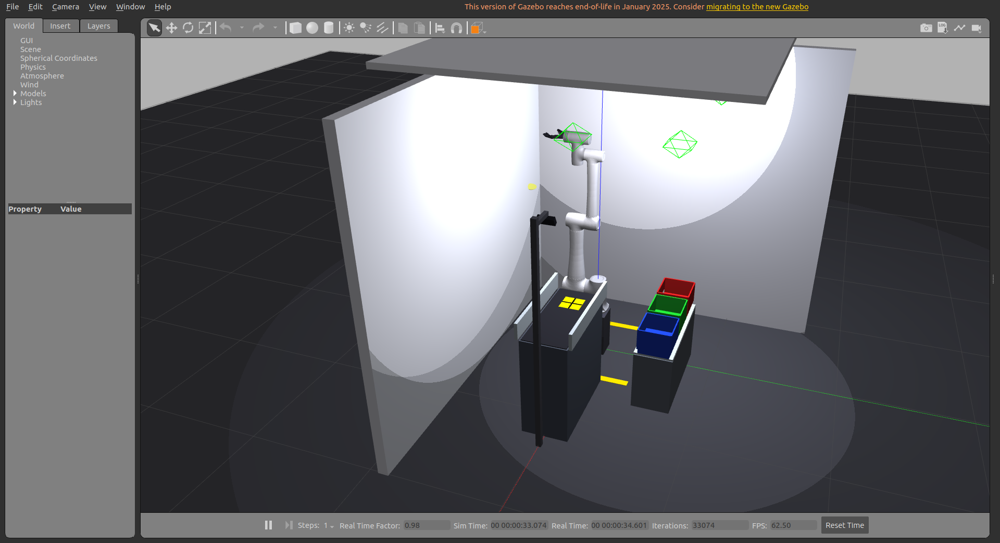
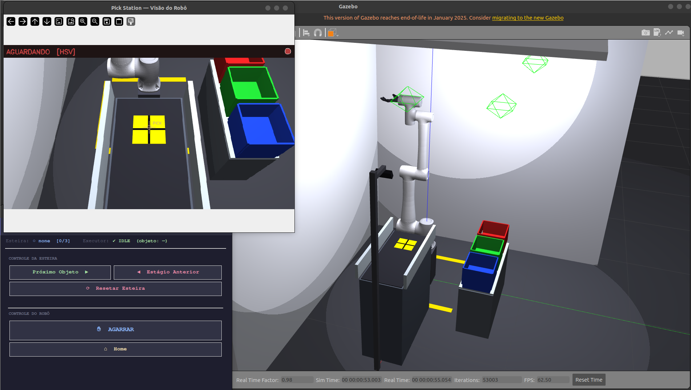
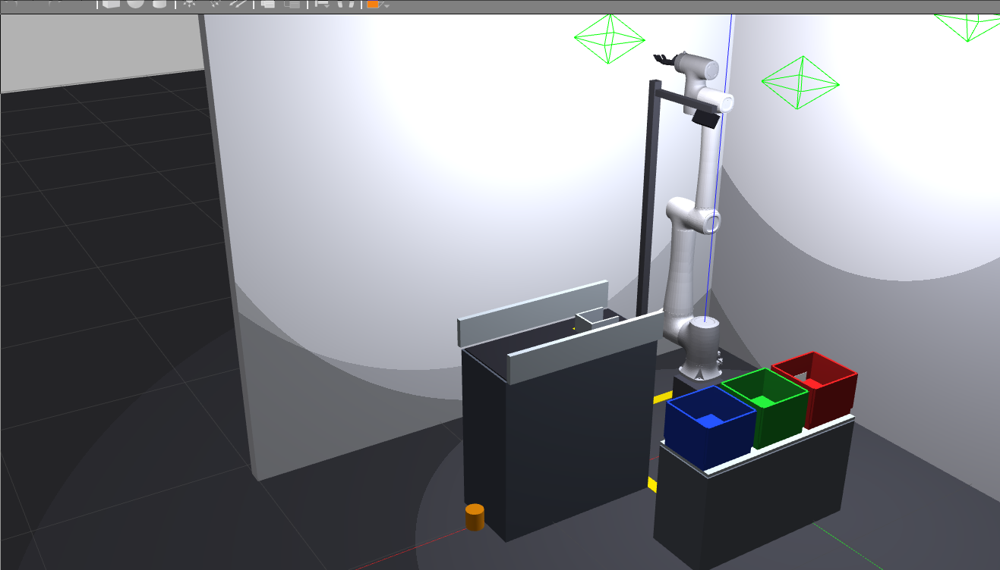
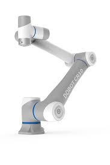
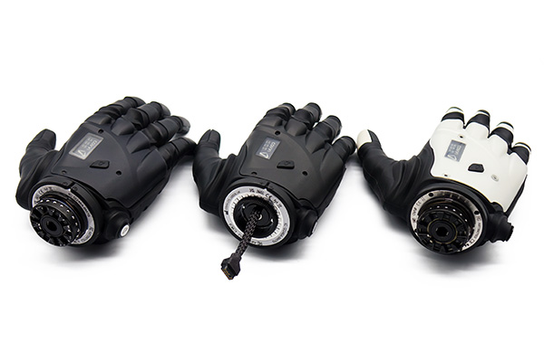

# RoboticArm — Gêmeo Digital CR10 + COVVI · Célula de Manufatura Biomédica

> Braço industrial + mão protética biônica + visão computacional + esteira, tudo em simulação — base de treinamento para usuários de próteses de mão de múltiplos graus de liberdade.

Este projeto integra o braço robótico **Dobot CR10** com a mão protética **COVVI Hand** em um gêmeo digital completo no **ROS 2 Humble / Gazebo Classic 11**. O sistema simula uma célula industrial de manufatura biomédica onde o robô identifica objetos farmacêuticos em uma esteira transportadora, classifica-os pelo tipo de preensão necessário e os deposita nas caixas de destino corretas — tudo de forma autônoma, guiado por visão computacional.

Este trabalho compõe o **Trabalho de Conclusão de Curso (TCC)** em Engenharia Biomédica cujo tema é o desenvolvimento de um sistema virtual de auxílio ao treinamento de usuários de próteses de mão com múltiplos graus de liberdade.

---

## Em ação

### Célula completa no Gazebo — visão geral

| Vista lateral da célula | Vista isométrica completa |
|---|---|
|  |  |

> Esteira transportadora à direita, braço CR10 com mão COVVI ao centro, três caixas de classificação (vermelha/verde/azul) à esquerda. Coluna de câmera montada atrás da esteira.

---

### GUI de controle + visão da câmera

| Estado ocioso — objeto na pick station | Braço estendido em fase de grasp |
|---|---|
|  |  |

> À esquerda: janela da câmera com detector HSV ativo mostrando objeto na esteira e bounding box em tempo real. À direita: painel de controle da célula (Estação de Serviço + Estação Geral).

---

### Detalhe da célula — caixas de classificação

| Closeup dos bins de destino | Visão de cima da célula |
|---|---|
|  |  |

---

### Hardware

| Braço Dobot CR10 | Mão COVVI |
|---|---|
|  |  |

| RViz — dedos abertos | RViz — dedos fechados |
|---|---|
|  |  |

---

## Contexto do TCC

Este projeto é o componente de **gêmeo digital** de um TCC cuja motivação central é o **auxílio ao treinamento de usuários de próteses de mão** com múltiplos graus de liberdade (MGL).

Usuários de próteses MGL enfrentam uma curva de aprendizado elevada: controlar individualmente cinco dedos para diferentes tipos de tarefa requer semanas de treino com terapeuta, hardware físico e objetos reais. O gêmeo digital proposto aqui permite que esse treinamento seja feito em simulação, antes do contato com o dispositivo físico, reduzindo custo, tempo e fadiga do usuário.

O diferencial deste sistema é o **pipeline de grasp diferenciado por visão computacional**: o robô identifica automaticamente o objeto (forma, tamanho, categoria farmacêutica), seleciona o tipo de preensão adequado (palm grip, claw grip, fingertip grip) e executa a sequência de movimento — exatamente como um sistema de controle preditivo embarcado numa prótese faria.

A célula de manufatura biomédica foi escolhida como cenário por ser representativa de ambientes de trabalho reais onde usuários de próteses atuam, e por exigir os três tipos principais de preensão funcional da mão COVVI.

---

## Objetos e tipos de preensão

| Objeto | Descrição | Tipo de Grasp | Caixa de Destino |
|---|---|---|---|
| **Frasco** | Frasco de medicamento (âmbar, ∅84 mm, h=90 mm) | Palm Grip | Box 1 — vermelha |
| **Tubo** | Tubo de ensaio (azul, ∅24 mm, h=120 mm) | Claw Grip | Box 2 — verde |
| **Ampola** | Ampola farmacêutica (verde, ∅10 mm, h=75 mm) | Fingertip Grip | Box 3 — azul |

Cada objeto tem cor específica na simulação Gazebo para a segmentação HSV:

| Objeto | Cor Gazebo | Faixa HSV |
|---|---|---|
| Frasco | Âmbar/laranja | H=8-26, S>120, V>80 |
| Tubo | Azul rico | H=100-135, S>80, V>50 |
| Ampola | Verde brilhante | H=38-85, S>110, V>80 |

---

## Arquitetura do sistema

O pipeline tem **5 nós ROS 2** comunicando em grafo, mais um **teach pendant** para programação manual de waypoints:

```
┌─────────────────────────────────────────────────────────────────────┐
│  Câmera RGB (Gazebo)                                                │
│  x=1.25, z=1.70, pitch=60°, yaw=180°  —  montada atrás da esteira  │
└──────────────────────────┬──────────────────────────────────────────┘
                           │ /camera/color/image_raw
                           ▼
┌──────────────────────────────────────────────────────────────────────┐
│  [object_detector]                                                   │
│  Segmentação HSV por cor → bounding box → back-projection geométrica │
│  Estima posição 3D do objeto: pixel (u,v) → world frame via R·d∩z    │
└──────────────────┬───────────────────────────────────────────────────┘
                   │ /detected_objects  (Detection2DArray + pose 3D)
                   ▼
┌──────────────────────────────────────────────────────────────────────┐
│  [grasp_executor]                                                    │
│  Recebe classe do objeto → escolhe grip + caixa destino              │
│  Calcula IK analítica para todas as poses do ciclo                   │
│  Executa 10 fases de movimento (F0–F9)                               │
└──────────────────┬───────────────────────────────────────────────────┘
                   │ /conveyor/retreat  (remove objeto após grasp)
                   │
┌──────────────────▼───────────────────────────────────────────────────┐
│  [conveyor_controller]                                               │
│  Gerencia sequência de objetos na esteira                            │
│  Spawn/delete no Gazebo via /spawn_entity e /delete_entity           │
└──────────────────────────────────────────────────────────────────────┘
           ▲                              ▲
           │ /conveyor/advance            │ /cell/execute_grasp
           │ /conveyor/retreat            │ /cell/go_home
           │ /conveyor/reset              │
┌──────────┴──────────────────────────────┴────────────────────────────┐
│  [gui_control]   GUI Tkinter com dois painéis                        │
│  "Estação de Serviço": controle da esteira                           │
│  "Estação Geral": disparo do ciclo de grasp + status                 │
└──────────────────────────────────────────────────────────────────────┘
           │
┌──────────▼───────────────────────────────────────────────────────────┐
│  [conveyor_pipeline]   Orquestrador autônomo (opcional)              │
│  Modo autônomo: advance → detect → execute → repeat                  │
│  Modo GUI: aguarda comandos manuais                                  │
└──────────────────────────────────────────────────────────────────────┘
```

### Ciclo de grasp — 10 fases

```
[F0] HOME → via_pick  (caminho Cartesiano — evita varredura sobre objetos)
[F1] Abrir mão + via_pick → approach_pick  (15 cm acima do objeto)
[F2] Descer com mão aberta + pré-configurar dedos
[F3] Fechar mão — grasp
     → /conveyor/retreat (remove objeto da esteira)
[F4] Levantar com objeto  (22 cm)
[F5] Trânsito para a caixa de destino  (caminho Cartesiano)
[F6] Descer na caixa  (caminho Cartesiano)
[F7] Abrir mão — soltar objeto
[F8] Subir ao via_box
[F9] Retornar ao HOME  (caminho Cartesiano)
```

---

## Cinemática

A cinemática inversa usa **multi-start DLS com lambda adaptativo** — damping alto (λ=0.08) para estabilização e decay exponencial até λ=0.003 para precisão fina.

O braço opera com **conversão de frames obrigatória**: o base_link do robô está em `world z = 0.405 m` (pedestal + offset URDF), portanto todas as posições world frame têm esse offset subtraído antes do cálculo IK.

Seeds por objeto foram determinados experimentalmente para garantir ramo de IK compacto (cotovelo acima da esteira) e ausência de colisões em toda a cadeia de waypoints. A análise completa está em `collision_analysis.py`.

```bash
ros2 run grasp_ml_pack test_kin
```
```
✓ pick station frasco  | err=  0.17 mm
✓ pick station tubo    | err=  0.03 mm
✓ pick station ampola  | err=  0.35 mm
✓ box1 (palm)          | err=  0.00 mm
✓ box2 (claw)          | err=  0.19 mm
✓ box3 (fingertip)     | err=  0.02 mm

Resultado geral: PASS ✓
```

---

## Hardware

| Componente | Modelo | Specs |
|---|---|---|
| Braço | **Dobot CR10** | 6-DOF, alcance 1375 mm, payload 10 kg |
| Mão | **COVVI Hand** | 5 dedos + 31 juntas (6 primárias + 25 mimic) |
| Câmera | RGB Gazebo | 848×480, FoV 70°, x=1.25 m, z=1.70 m, pitch=60°, yaw=180° |

---

## Requisitos

| | Versão |
|---|---|
| Ubuntu | 22.04 LTS |
| ROS 2 | Humble Hawksbill |
| Gazebo | Classic 11 |
| Python | 3.10+ |

```bash
# Dependências ROS 2
sudo apt install -y \
  ros-humble-gazebo-ros-pkgs \
  ros-humble-ros2-control \
  ros-humble-ros2-controllers \
  ros-humble-gazebo-ros2-control \
  ros-humble-xacro \
  ros-humble-joint-state-publisher-gui \
  ros-humble-vision-msgs \
  ros-humble-cv-bridge \
  python3-tk

# Python — numpy<2 obrigatório (cv_bridge do Humble compilado com NumPy 1.x)
pip install "numpy<2" opencv-python
```

---

## Instalação

```bash
git clone https://github.com/Martins-Lucaas/RoboticArm.git ~/RoboticArm
cd ~/RoboticArm
colcon build --symlink-install
source install/setup.bash
```

---

## Rodando

### Célula completa — pipeline da esteira (recomendado)

```bash
ros2 launch grasp_ml_pack conveyor_cell.launch.py
```

O que acontece ao lançar:
1. **Gazebo** carrega a cena `conveyor_cell.world` com esteira, pedestal, caixas e câmera
2. **Robot State Publisher** sobe com o URDF completo CR10 + COVVI
3. **Controllers** carregam em cadeia: `joint_state_broadcaster` → `cr10_group_controller` → `hand_position_controller`
4. **Nós do pipeline** sobem depois que os controllers estão ativos
5. Uma janela **"Pick Station — Visão do Robô"** abre mostrando o feed da câmera com detecções em tempo real

O terminal estará pronto quando mostrar:
```
[conveyor_controller] ConveyorController pronto | sequência: ['frasco', 'tubo', 'ampola']
[grasp_executor]      GraspExecutor pronto.
[object_detector]     ObjectDetector pronto — modo: HSV-simulação | objetos: frasco / tubo / ampola
```

### Operação pela GUI

Com o launch rodando, a **GUI de Controle** abre automaticamente com dois painéis:

**Painel "Estação de Serviço" (esteira):**
| Botão | Ação |
|---|---|
| `Avançar Esteira` | Traz o próximo objeto para a pick station |
| `Recuar Esteira` | Remove o objeto atual da pick station |
| `Resetar Esteira` | Reinicia a sequência de objetos |

**Painel "Estação Geral" (braço):**
| Botão | Ação |
|---|---|
| `AGARRAR` | Inicia ciclo completo pick→lift→place para o objeto detectado |
| `Home` | Envia braço para posição home |

**Fluxo típico de operação:**
1. Clique `Avançar Esteira` — objeto spawna em x=0.75, y=0, z=2.0 e cai na esteira
2. Aguarde o objeto aparecer na janela da câmera com bounding box
3. Clique `AGARRAR` — o braço executa as 10 fases e deposita na caixa certa

### Modo autônomo

Para ciclos automáticos sem interação manual, edite `pipeline_params.yaml`:

```yaml
conveyor_pipeline:
  ros__parameters:
    autonomous: true      # ← muda para true
    total_cycles: 9       # 3 ciclos × 3 objetos
```

### Teach Pendant — programação manual de waypoints

O teach pendant permite jogar o braço manualmente, gravar waypoints e exportá-los para uso no pipeline automático.

```bash
ros2 run grasp_ml_pack teach_pendant
```

A GUI abre com dois painéis:

**Painel esquerdo — controle do braço:**
- Sliders individuais para cada junta (J1–J6) com limites do CR10
- Botões `+` / `−` para jog incremental por junta
- Botão `Go Home` para retornar à posição home

**Painel direito — waypoints:**
| Botão | Ação |
|---|---|
| `Gravar Waypoint` | Captura a configuração atual das juntas |
| `Ir para` | Envia o braço para o waypoint selecionado |
| `Remover` | Remove o waypoint selecionado da lista |
| `Exportar YAML` | Salva todos os waypoints em arquivo `.yaml` |
| `Exportar Python` | Gera snippet Python com `TEACH_WAYPOINTS = [...]` |

O arquivo `config/teach_sequence.yaml` contém os waypoints gravados para a pick station do frasco (posição de referência).

### Controle manual da mão e braço (sem pipeline)

```bash
ros2 launch hand_pack cr10_covvi_gazebo.launch.py
```

Permite controlar a mão COVVI e as juntas do CR10 individualmente pela GUI combinada.

---

## Estrutura do projeto

```
RoboticArm/
├── images/                              screenshots e mídia
├── teach_sequence.yaml                  waypoints gravados pelo teach pendant
├── collision_analysis.py                análise de colisão offline (FK + AABB + cantos STL)
├── src/
│   ├── grasp_ml_pack/                   pacote principal — célula de manufatura
│   │   ├── config/
│   │   │   ├── pipeline_params.yaml     parâmetros de todos os nós
│   │   │   └── teach_sequence.yaml      cópia dos waypoints gravados
│   │   ├── grasp_ml_pack/
│   │   │   ├── kinematics.py            IK analítica CR10 (DH, multi-start DLS)
│   │   │   ├── object_detector.py       detecção HSV + back-projection 2D→3D
│   │   │   ├── grasp_executor.py        ciclo pick→lift→place (10 fases, F0–F9)
│   │   │   ├── conveyor_controller.py   spawn/delete objetos + serviços de esteira
│   │   │   ├── gui_control_node.py      GUI Tkinter (esteira + braço)
│   │   │   ├── teach_pendant.py         teach pendant: jog + gravação + exportação
│   │   │   └── pipeline.py              orquestrador (máquina de estados)
│   │   ├── launch/
│   │   │   └── conveyor_cell.launch.py  launch principal da célula
│   │   └── worlds/
│   │       └── conveyor_cell.world      cena Gazebo completa
│   ├── hand_pack/                       controle manual da mão
│   │   ├── config/
│   │   │   └── cr10_covvi_controllers.yaml
│   │   ├── hand_pack/
│   │   │   ├── hand_gui.py
│   │   │   └── combined_gui.py
│   │   ├── launch/
│   │   │   ├── cr10_covvi_gazebo.launch.py
│   │   │   └── cr10_covvi_rviz.launch.py
│   │   └── urdf/
│   │       └── linear_covvi_hand_gazebo.urdf
│   └── DOBOT_6Axis_ROS2_V4/             descrição URDF do CR10 (submodule)
└── TCC/
    └── projeto_grasp_autonomo_ml.txt    documentação técnica e contexto acadêmico
```

---

## Tópicos principais

| Tópico | Tipo | Descrição |
|---|---|---|
| `/camera/color/image_raw` | `sensor_msgs/Image` | Feed RGB bruto da câmera Gazebo |
| `/detector/debug_image` | `sensor_msgs/Image` | Feed com bounding boxes desenhadas |
| `/detected_objects` | `vision_msgs/Detection2DArray` | Detecções com classe + posição 3D world |
| `/conveyor/status` | `std_msgs/String` (JSON) | Estado da esteira (has_object, current_obj) |
| `/conveyor/advance` | `std_srvs/Trigger` | Serviço: avança próximo objeto |
| `/conveyor/retreat` | `std_srvs/Trigger` | Serviço: remove objeto atual |
| `/conveyor/reset` | `std_srvs/Trigger` | Serviço: reinicia sequência |
| `/cell/execute_grasp` | `std_srvs/Trigger` | Serviço: inicia ciclo de grasp |
| `/cell/go_home` | `std_srvs/Trigger` | Serviço: envia braço ao home |
| `/cell/status` | `std_msgs/String` (JSON) | Estado do executor (APPROACH_PICK, GRASPING…) |
| `/joint_states` | `sensor_msgs/JointState` | Posições das 37 juntas (6 braço + 31 mão) |

---

## Comandos úteis

```bash
# Rebuildar apenas o pacote principal
colcon build --packages-select grasp_ml_pack --symlink-install
source install/setup.bash

# Ver o que a câmera enxerga (alternativa ao imshow)
ros2 run rqt_image_view rqt_image_view /detector/debug_image

# Monitorar estado da esteira
ros2 topic echo /conveyor/status

# Monitorar estado do executor
ros2 topic echo /cell/status

# Acionar esteira manualmente via terminal
ros2 service call /conveyor/advance std_srvs/srv/Trigger {}
ros2 service call /conveyor/retreat std_srvs/srv/Trigger {}
ros2 service call /conveyor/reset   std_srvs/srv/Trigger {}

# Disparar ciclo de grasp via terminal
ros2 service call /cell/execute_grasp std_srvs/srv/Trigger {}

# Verificar controllers ativos
ros2 control list_controllers

# Matar processos Gazebo travados
pkill -f gzserver; pkill -f gzclient

# Testar IK isoladamente
ros2 run grasp_ml_pack test_kin

# Análise de colisão offline
python3 collision_analysis.py
```

> **Build com erro de symlink?** Se aparecer `symbolic link ... Is a directory`:
> ```bash
> rm -rf build/dobot_msgs_v4/ament_cmake_python/dobot_msgs_v4/dobot_msgs_v4
> colcon build --symlink-install
> ```

---

## Diagnóstico rápido

| Sintoma | Causa provável | Solução |
|---|---|---|
| Objeto não aparece na câmera | Objeto ainda caindo / HSV errado | Aguardar 2-3 s após spawn; verificar janela da câmera |
| `AGARRAR` retorna "Nenhum objeto válido" | Detector sem detecção ativa | Verificar janela "Pick Station" — readvance a esteira |
| `Goal rejeitado` no terminal | Controller não ativo | `ros2 control list_controllers` — verificar estado |
| Braço para no meio do ciclo | IK falhou em alguma pose | Verificar logs `[FALHA]` no terminal do grasp_executor |
| Objeto cai fora da pick station | `spawn_z` muito baixo ou física | Confirmar `spawn_z: 2.0` no `pipeline_params.yaml` |

---

## RViz — Visualizações da mão COVVI

| Malha visual completa | Malha de colisão |
|---|---|
|  |  |

| Blender — constraints | CAD — dedos estendidos |
|---|---|
|  |  |

---

## Licença

Apache-2.0

Desenvolvido por **Lucas Martins** — [lucaspmartins14@gmail.com](mailto:lucaspmartins14@gmail.com)  
TCC — Engenharia Biomédica
