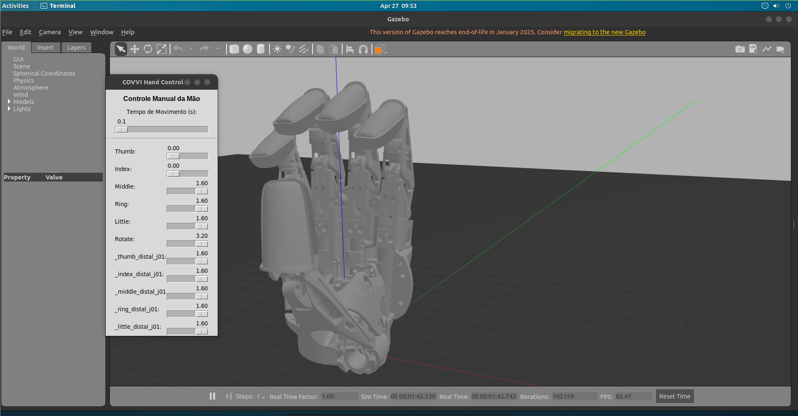
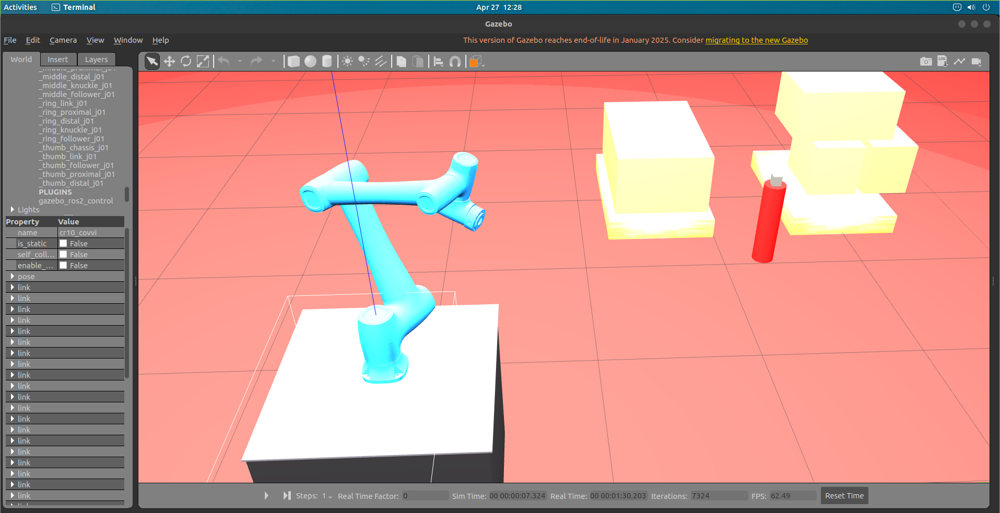
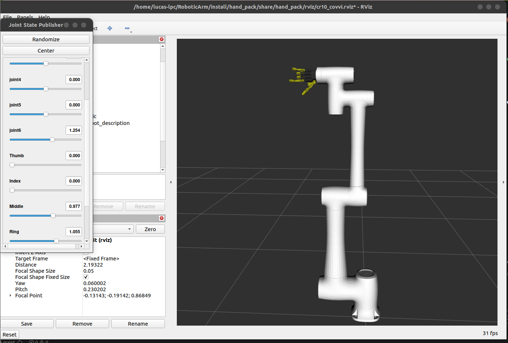
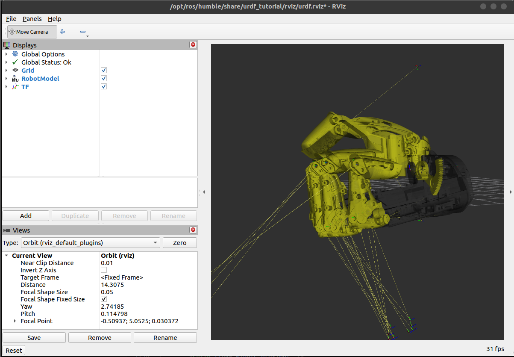
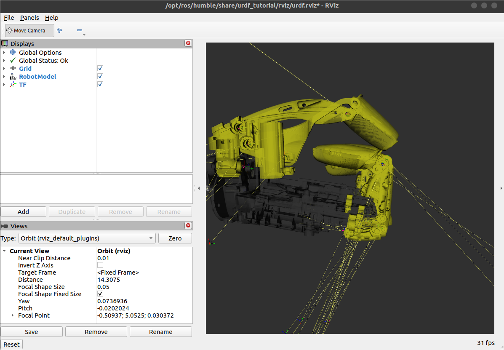

# RoboticArm — Digital Twin COVVI Hand + CR10

Gêmeo Digital (Digital Twin) da mão biônica **COVVI** integrada ao braço robótico industrial **Dobot CR10**, desenvolvido em **ROS 2 Humble** com simulação no **Gazebo Classic** e visualização no **RViz2**.

O projeto cobre desde a simulação isolada da mão até a operação completa braço + mão em um ambiente de fábrica, com controle manual via interface gráfica (GUI) e integração com `ros2_control`.

---

## Demonstração

### Mão COVVI no Gazebo com GUI de Controle

> Simulação da mão COVVI no Gazebo com o painel de controle manual aberto. Cada dedo pode ser movimentado individualmente pelos sliders, com controle de velocidade.

### Braço CR10 + Mão COVVI no Gazebo (Ambiente de Fábrica)

> Integração do braço CR10 com a mão COVVI em um world com caixas e obstáculos. Base para tarefas de pick-and-place.

### Integração CR10 + COVVI no RViz2 (Joint State Publisher)

> Visualização completa do sistema braço + mão no RViz2. O Joint State Publisher permite mover cada junta manualmente para validar a cinemática.

### Mão COVVI Isolada no RViz2
| Mão Aberta | Mão Fechada |
|---|---|
|  |  |

---

## Funcionalidades

- **Simulação de Alta Fidelidade** — URDF com malhas STL originais da COVVI Hand, inércias e massas calibradas para comportamento físico realista no Gazebo.
- **Controle via ROS 2 Control** — `joint_trajectory_controller` para movimentos suaves e precisos em todas as 11 juntas.
- **GUI de Controle Manual** — Interface Python/Tkinter com sliders individuais por dedo, controle de velocidade e interpolação de trajetória.
- **Integração CR10 + COVVI** — Launch files prontos para subir o sistema completo (braço + mão) no Gazebo e no RViz2.
- **Ambiente de Fábrica** — World Gazebo com caixas e obstáculos para testes de manipulação.
- **Arquitetura Modular** — Pacote `hand_pack` independente, podendo ser adaptado a outros braços robóticos.

---

## Requisitos

| Componente | Versão |
|---|---|
| Ubuntu | 22.04 LTS (Jammy) |
| ROS 2 | Humble Hawksbill |
| Gazebo | Classic (Gazebo 11) |
| Python | 3.10+ |

### Dependências ROS 2

```bash
sudo apt update
sudo apt install -y \
  ros-humble-gazebo-ros-pkgs \
  ros-humble-ros2-control \
  ros-humble-ros2-controllers \
  ros-humble-xacro \
  ros-humble-joint-state-publisher-gui \
  python3-tk
```

---

## Estrutura do Repositório

```
RoboticArm/
└── src/
    ├── hand_pack/                  # Pacote principal
    │   ├── config/
    │   │   ├── hand_controller.yaml          # Controladores da mão COVVI
    │   │   └── cr10_covvi_controllers.yaml   # Controladores CR10 + COVVI
    │   ├── hand_pack/
    │   │   ├── hand_gui.py         # GUI de controle da mão (sliders)
    │   │   └── combined_gui.py     # GUI combinada braço + mão
    │   ├── launch/
    │   │   ├── spawn_hand.launch.xml          # Mão COVVI isolada no Gazebo
    │   │   ├── hand_gazebo.launch.py          # Mão COVVI no Gazebo (Python)
    │   │   ├── display.launch.py              # Mão COVVI no RViz2
    │   │   ├── cr10_covvi_gazebo.launch.py    # CR10 + COVVI no Gazebo
    │   │   └── cr10_covvi_rviz.launch.py      # CR10 + COVVI no RViz2
    │   ├── urdf/
    │   │   └── linear_covvi_hand_gazebo.urdf  # Modelo completo da mão
    │   ├── rviz/
    │   │   └── cr10_covvi.rviz    # Configuração de visualização
    │   └── worlds/
    │       └── factory.world      # Ambiente de fábrica para o Gazebo
    └── DOBOT_6Axis_ROS2_V4/       # Pacote do braço CR10 (submodule externo)
```

---

## Instalação

```bash
# Clone o repositório
git clone https://github.com/Martins-Lucaas/RoboticArm.git ~/RoboticArm

# Entre no workspace e compile
cd ~/RoboticArm
colcon build --packages-select hand_pack
source install/setup.bash
```

---

## Como Usar

### Mão COVVI isolada no Gazebo

```bash
ros2 launch hand_pack spawn_hand.launch.xml
```

Após o Gazebo abrir, inicie a GUI de controle:

```bash
ros2 run hand_pack hand_gui
```

### CR10 + COVVI no Gazebo (Ambiente de Fábrica)

```bash
ros2 launch hand_pack cr10_covvi_gazebo.launch.py
```

### CR10 + COVVI no RViz2

```bash
ros2 launch hand_pack cr10_covvi_rviz.launch.py
```

### GUI de Controle Manual

| Controle | Descrição |
|---|---|
| **Tempo de Movimento** | Velocidade do movimento em segundos |
| **Thumb / Index / Middle / Ring / Little** | Flexão proximal de cada dedo |
| **Rotate** | Oposição/rotação do polegar |
| **Sliders `_j01`** | Falanges distais (pontas dos dedos) |

---

## Detalhes Técnicos

### Calibração Física (Gazebo)

- **Inércias e massas** ajustadas para evitar oscilações e explosões físicas ao spawnar.
- **Juntas mecânicas auxiliares** (`_l1`, `_follower`) configuradas como `fixed` para manter a integridade visual das malhas sem criar graus de liberdade extras.
- **Limites de esforço** (`effort="1000"`) e velocidade elevados para simular a força real dos atuadores COVVI sem delays perceptíveis.

### Controladores (ros2_control)

O pacote usa `joint_trajectory_controller` para as 11 juntas ativas da mão:

```
Thumb | Index | Middle | Ring | Little  (proximais)
Thumb_j01 | Index_j01 | Middle_j01 | Ring_j01 | Little_j01  (distais)
Rotate  (oposição do polegar)
```

---

## Licença

Distribuído sob a licença **Apache-2.0**.

Desenvolvido por **Lucas Martins**
